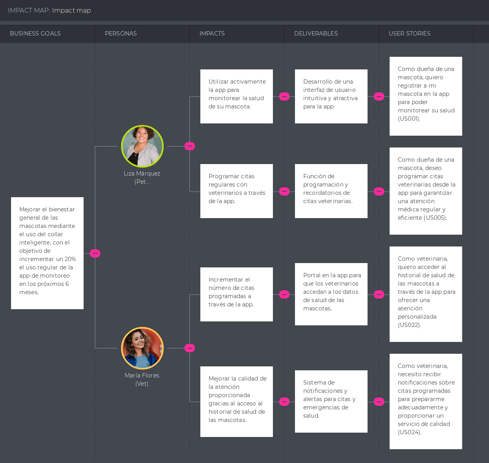

# Capítulo III: Requirements Specification

## 3.1. To-Be Scenario Mapping.

El To-Be Scenario Mapping es una herramienta clave para proyectar mejoras en el proceso de monitoreo y cuidado de mascotas, utilizando la información obtenida en el As-Is Scenario Mapping. Examina las etapas del cuidado de las mascotas desde las perspectivas del dueño y del veterinario, identificando oportunidades de mejora. Mediante la aplicación y el uso del collar inteligente, se busca solucionar problemas identificados y potenciar la calidad del servicio. Así, se facilita una mejor experiencia para dueños y veterinarios, erradicando incidencias negativas y fomentando un cuidado óptimo para las mascotas.

- **Dueños de Mascotas**  

  

- **Dueños de Veterinarias**  

  

## 3.2. User Stories.

En esta sección se presentarán las User Stories y Epics de nuestro proyecto. Los User Stories y Epics están descritos siguiendo el patrón "As a - I want - So that". Por otro lado, los User Stories poseen criterios de aceptación, los cuales están organizados por escenarios y descritos siguiendo el patrón "Given - When - Then".

### **Epics**

##### Epic 1: Registro y Gestión de Información de Usuarios y Mascotas

- E001 - Registro de Dueño y Perfil de Mascota (US001)
- E002 - Actualización de Información de Mascota (US007)

##### Epic 2: Monitoreo de Salud y Bienestar

- E003 - Monitoreo Continuo de Salud en Tiempo Real (US002)
- E004 - Generación de Alertas por Anomalías de Salud (US003)
- E005 - Provisión de Diagnósticos Preliminares (US004)
- E006 - Consulta del Historial Médico (US006)
- E007 - Seguimiento de Actividad Física (US011)
- E008 - Establecimiento de Metas de Salud (US012)
- E009 - Análisis del Comportamiento y Estado de Ánimo (US015)

##### Epic 3: Servicios Veterinarios Integrados

- E010 - Programación de Citas Veterinarias (US005)
- E011 - Compartir Historial con Veterinarios (US008)
- E012 - Acceso a Servicios de Emergencia (US018)

##### Epic 4: Comunidad y Comunicación

- E013 - Recepción de Consejos de Cuidado Personalizado(US009)
- E014 - Comunidad de Dueños de Mascotas (US017)
- E015 - Reporte de Pérdida de Mascota (US016)

##### Epic 5: Configuración y Personalización

- E016 - Configuración de Alertas y Notificaciones (US010)
- E017 - Configuración de Recordatorios de Medicación (US013)

##### Epic 6: Información Nutricional y Educativa

- E018 - Información Sobre Nutrición (US014)
- E019 - Reseñas de Veterinarias (US019)

##### Epic 7: Integración Tecnológica Avanzada

- E020 - Integración con Dispositivos de Casa Inteligente (US020)

##### Epic 8: Soporte Técnico y Servicios para Veterinarios

- Este Epic incluirá todas las User Stories desde US021 hasta US040, ya que todas están enfocadas en proporcionar soporte, herramientas y servicios a veterinarios y clínicas veterinarias.

  - E021 - Registro de Veterinaria en la Aplicación (US021)
  - E022 - Acceso al Historial de Salud de Mascotas (US022)
  - E023 - Gestión de Citas (US023)
  - E024 - Envío de Recordatorios de Citas (US024)
  - E025 - Recepción de Alertas de Salud Urgentes (US025)
  - E026 - Publicación de Información de Salud (US026)
  - E027 - Personalización de Servicios Ofrecidos (US027)
  - E028 - Visualización de Estadísticas de Salud (US028)
  - E029 - Feedback sobre el Servicio (US029)
  - E030 - Integración con Sistemas de Gestión Veterinaria (US030)
  - E031 - Actualizaciones en Tiempo Real de la Salud de la Mascota (US031)
  - E032 - Programa de Fidelidad para Dueños de Mascotas (US032)
  - E033 - Análisis de Tendencias de Salud (US033)
  - E034 - Soporte para Múltiples Especialidades Veterinarias (US034)
  - E035 - Administración de Historiales de Salud Digitales (US035)
  - E036 - Publicación de Casos de Estudio (US036)
  - E037 - Webinars y Eventos Educativos (US037)
  - E038 - Gestión de Citas y Recordatorios Automatizados (US038)
  - E039 - Integración con Laboratorios para Análisis (US039)
  - E040 - Soporte y Asesoramiento en Línea (US040)

##### Epic 9: Presentación y Navegación en la Landing Page

  - E041 - Introducción Clara y Atractiva en la Landing Page (US041)
  - E042 - Testimonios y Casos de Éxito para Veterinarios en la Landing Page (US042)

##### Epic 10: Desarrollo Backend y API para la Plataforma

  - E043 - Implementación de RESTful API para Comunicación Eficiente (TS001)
  - E044 - Establecimiento de Mecanismo de Autenticación y Autorización para APIs (TS002)
  - E045 - Implementación de Logging y Monitoreo para APIs (TS003)

| User StoryID | Title                                                    | Description                                                                                                                                                                                                                                                                        | Acceptance Criteria                                                                                                                                                                                                                                                                                                                                                                                                                                                                                                                                                                                                                                                                                                                                                                                                          | Epic ID |
| ------------ | -------------------------------------------------------- | ---------------------------------------------------------------------------------------------------------------------------------------------------------------------------------------------------------------------------------------------------------------------------------- | ---------------------------------------------------------------------------------------------------------------------------------------------------------------------------------------------------------------------------------------------------------------------------------------------------------------------------------------------------------------------------------------------------------------------------------------------------------------------------------------------------------------------------------------------------------------------------------------------------------------------------------------------------------------------------------------------------------------------------------------------------------------------------------------------------------------------------- | ------- |
| US001        | Registro de Dueño y Perfil de Mascota                    | Como dueño de mascota, Quiero registrar mis datos personales y los de mi mascota, Para que pueda gestionar el perfil y los servicios disponibles en la aplicación.                                                                                                                 | **SCENARIO 1:** Registro Completo  **Given:** que el usuario accede a la página de registro,  **When:** completa todos los campos requeridos y envía el formulario,  **Then:** el sistema confirma el registro y proporciona acceso a las funcionalidades específicas para dueños y mascotas.   **SCENARIO 2:** Campos Obligatorios Incompletos  **Given:** que el usuario está en el formulario de registro,  **When:** intenta enviar el formulario sin completar todos los campos obligatorios,  **Then:** el sistema muestra un mensaje de error y resalta los campos que necesitan ser completados.                                                                                                                                                                                             | E001    |
| US002        | Monitoreo Continuo de Salud en Tiempo Real               | Como dueño de una mascota, Quiero visualizar en tiempo real los indicadores de salud de mi mascota, Para que pueda estar al tanto de su bienestar y reaccionar rápidamente a cualquier problema.                                                                                   | **SCENARIO 1:** Monitoreo Exitoso **Given:** que el collar inteligente está activo y la mascota lo lleva puesto,  **When:** el dueño accede a la sección de monitoreo en la aplicación,  **Then:** ve en tiempo real los indicadores como actividad física, frecuencia cardíaca y temperatura.  **SCENARIO 2:** Collar Desconectado  **Given:** que el collar inteligente se ha desconectado,  **When:** el dueño intenta ver los indicadores de salud,  **Then:** recibe una notificación sobre la desconexión y se le sugiere verificar el dispositivo.                                                                                                                                                                                                                                            | E003    |
| US003        | Generación de Alertas por Anomalías de Salud             | Como dueño de una mascota, Quiero recibir alertas automáticas si se detectan anomalías en los datos de salud de mi mascota, Para que pueda tomar medidas inmediatas en caso de emergencia.                                                                                         | **SCENARIO 1:** Alerta de Anomalía Detectada **Given:** que el sistema analiza continuamente los datos de salud, **When:** detecta una anomalía significativa en los parámetros de salud, **Then:** envía una alerta inmediata al dueño con detalles y recomendaciones preliminares.  **SCENARIO 2:** Falsa Alarma **Given:** que se ha enviado una alerta al dueño, **When:** se verifica y se descubre que fue una falsa alarma debido a un error del sensor,  **Then:** el dueño puede marcar la alerta como falsa alarma y el sistema ajusta los parámetros para reducir la incidencia de falsas alarmas en el futuro.                                                                                                                                                                           | E004    |
| US004        | Provisión de Diagnósticos Preliminares                   | Como dueño de una mascota, Quiero obtener diagnósticos preliminares basados en los datos recogidos por el collar inteligente, Para que pueda tener una mejor comprensión de la salud de mi mascota y decidir si es necesario visitar al veterinario.                               | **SCENARIO 1:** Diagnóstico Preliminar Proporcionado **Given:** que el dueño consulta los diagnósticos preliminares en la aplicación, **When:** hay suficientes datos recopilados por el collar, **Then:** el sistema proporciona un diagnóstico preliminar que ayuda al dueño a entender la posible condición de la mascota.  **SCENARIO 2:** Datos Insuficientes **Given:** que el dueño busca un diagnóstico preliminar, **When:** no hay suficientes datos para formular uno, **Then:** el sistema notifica al dueño sobre la insuficiencia de datos y recomienda mantener un monitoreo continuo o visitar al veterinario.                                                                                                                                                                       | E005    |
| US005        | Agendamiento Directo de Citas Veterinarias               | Como dueño de una mascota, Quiero programar citas con veterinarios directamente a través de la aplicación, Para que pueda asegurar una atención médica oportuna para mi mascota sin complicaciones.                                                                                | **SCENARIO 1:** Cita Programada Exitosamente  **Given:** que el dueño necesita atención médica para su mascota,  **When:** selecciona un veterinario disponible y elige un horario adecuado,  **Then:** la cita se programa y el dueño recibe una confirmación inmediata.   **SCENARIO 2:** No Hay Horarios Disponibles  **Given:** que el dueño intenta agendar una cita,  **When:** no hay horarios disponibles para el veterinario seleccionado,  **Then:** el sistema muestra un mensaje de no disponibilidad y sugiere horarios alternativos o diferentes veterinarios.                                                                                                                                                                                                                         | E010    |
| US006        | Consulta del Historial Médico                            | Como dueño de una mascota, Quiero acceder y revisar el historial médico completo de mi mascota en la aplicación, Para que pueda estar informado sobre su salud y tratamientos anteriores.                                                                                          | **SCENARIO 1:** Acceso al Historial  **Given:** que el dueño desea revisar el historial médico,  **When:** accede a la sección de historial en la aplicación,  **Then:** puede visualizar todos los eventos médicos registrados, incluyendo visitas al veterinario, diagnósticos y tratamientos.   **SCENARIO 2:** Historial Incompleto  **Given:** que el dueño revisa el historial médico  **When:** algunos eventos no están documentados,  **Then:** el sistema permite al dueño añadir información faltante o solicitar registros antiguos al veterinario.                                                                                                                                                                                                                                      | E006    |
| US007        | Actualización de Información de Mascota                  | Como dueño de una mascota, Quiero editar y actualizar la información de mi mascota en la aplicación, Para que el perfil siempre refleje la situación actual y precisa.                                                                                                             | **SCENARIO 1:** Actualización Exitosa  **Given:** que el usuario accede a la información de su mascota,  **When:** actualiza los datos necesarios y guarda los cambios,  **Then:** el sistema actualiza el perfil y confirma la actualización al usuario.   **SCENARIO 2:** Error al Guardar  **Given:** que el usuario intenta actualizar la información,  **When:** hay un error en el sistema al intentar guardar,  **Then:** el sistema muestra un mensaje de error y sugiere intentar más tarde.                                                                                                                                                                                                                                                                                                | E002    |
| US008        | Compartir Historiales Médicos con Veterinarios           | Como dueño de una mascota, Quiero compartir el historial médico de mi mascota con veterinarios a través de la app, Para que puedan ofrecer una atención informada y personalizada.                                                                                                 | **SCENARIO 1:** Compartir Historial Exitosamente  **Given:** que el dueño selecciona la opción de compartir historial,  **When:** elige un veterinario registrado en la app y confirma la acción,  **Then:** el historial se comparte y el sistema notifica al dueño y al veterinario.   **SCENARIO 2:** Veterinario no Registrado  **Given:** que el dueño intenta compartir el historial,  **When:** selecciona un veterinario que no está registrado en la aplicación,  **Then:** el sistema informa que el veterinario no está disponible para recibir historiales y sugiere invitar al veterinario a registrarse en la plataforma.                                                                                                                                                              | E011    |
| US009        | Recepción de Consejos de Cuidado Personalizado           | Como dueño de una mascota, Quiero recibir consejos personalizados sobre el cuidado de mi mascota basados en su salud y comportamiento, Para que pueda proporcionar un cuidado óptimo y específico para sus necesidades.                                                            | **SCENARIO 1:** Recepción de Consejos Personalizados  **Given:** que el dueño accede a la sección de consejos,  **When:** hay datos suficientes sobre la salud y actividad de la mascota,  **Then:** el sistema proporciona consejos personalizados que reflejan las necesidades específicas de la mascota.   **SCENARIO 2:** Datos Insuficientes para Personalización  **Given:** que el dueño busca consejos personalizados,  **When:** los datos sobre la mascota son insuficientes para una personalización efectiva,  **Then:** el sistema ofrece consejos generales y sugiere completar más información sobre la mascota.                                                                                                                                                                      | E013    |
| US010        | Personalización de Alertas y Notificaciones              | Como dueño de una mascota, Quiero configurar y personalizar alertas y notificaciones sobre la salud y bienestar de mi mascota, Para que pueda estar informado de manera proactiva sobre cualquier cambio importante.                                                               | **SCENARIO 1:** Configuración Exitosa de Alertas  **Given:** que el dueño accede a la sección de configuración de notificaciones,  **When:** selecciona sus preferencias de alertas y guarda la configuración,  **Then:** el sistema aplica las configuraciones y confirma al dueño que las alertas se configuraron correctamente.   **SCENARIO 2:** Fallo al Guardar Configuraciones  **Given:** que el dueño intenta configurar alertas,  **When:** hay un fallo técnico que impide guardar las configuraciones, **Then:** el sistema muestra un mensaje de error y sugiere intentar la configuración nuevamente.                                                                                                                                                                                  | E016    |
| US011        | Seguimiento de Actividad Física                          | Como dueño de una mascota, Quiero seguir y analizar los niveles de actividad física de mi mascota, Para que pueda asegurarme de que recibe el ejercicio necesario para su salud.                                                                                                   | **SCENARIO 1:** Seguimiento Exitoso de la Actividad  **Given:** que el dueño revisa la actividad diaria de su mascota,  **When:** accede a la sección de actividad física en la aplicación,  **Then:** el sistema muestra un resumen detallado de la actividad física, incluyendo pasos, distancia recorrida y calorías quemadas.   **SCENARIO 2:** Datos de Actividad Incompletos  **Given:** que el dueño consulta los niveles de actividad,  **When:** el dispositivo de seguimiento no ha capturado algunos datos debido a un error técnico o desconexión, **Then:** el sistema notifica al dueño sobre la falta de datos y sugiere verificar el dispositivo.                                                                                                                                    | E007    |
| US012        | Establecimiento de Metas de Salud                        | Como dueño de una mascota, Quiero establecer metas específicas de salud para mi mascota, como peso ideal, nivel de actividad y dieta, Para que pueda monitorear y promover un estilo de vida saludable para ella.                                                                  | **SCENARIO 1:** Creación de Metas de Salud  **Given:** que el dueño desea establecer metas de salud,  **When:** define y guarda las metas en la aplicación, **Then:** el sistema confirma la creación de las metas y las muestra en el perfil de la mascota.   **SCENARIO 2:** Metas No Realistas  **Given:** que el dueño establece metas de salud que no son adecuadas para la especie, raza o edad de la mascota,  **When:** el sistema evalúa las metas ingresadas, **Then:** advierte al dueño sobre la no adecuación de las metas y ofrece recomendaciones basadas en estándares veterinarios aceptados.                                                                                                                                                                                       | E008    |
| US013        | Configuración de Recordatorios para Medicación           | Como dueño de una mascota, Quiero configurar recordatorios para la administración de medicamentos de mi mascota, Para que pueda asegurarme de que recibe su tratamiento a tiempo y correctamente.                                                                                  | **SCENARIO 1:** Configuración Exitosa de Recordatorios  **Given:** que el dueño accede a la sección de salud de su mascota,  **When:** configura y activa los recordatorios para medicamentos específicos y los tiempos de administración, **Then:** el sistema guarda la configuración y comienza a enviar recordatorios según lo programado.   **SCENARIO 2:** Error al Guardar Configuraciones  **Given:** que el dueño intenta configurar los recordatorios de medicación,  **When:** hay un fallo técnico que impide guardar la configuración, **Then:** el sistema muestra un mensaje de error y sugiere intentar la configuración nuevamente.                                                                                                                                                 | E017    |
| US014        | Educación sobre Nutrición Animal                         | Como dueño de una mascota, Quiero recibir información y recomendaciones personalizadas sobre nutrición basadas en la salud y actividad de mi mascota, Para que pueda ofrecer una dieta adecuada y saludable.                                                                       | **SCENARIO 1:** Recomendaciones de Nutrición Proporcionadas  **Given:** que el dueño consulta la sección de nutrición en la aplicación,  **When:** hay datos suficientes sobre la salud y actividad de la mascota, **Then:** el sistema proporciona recomendaciones de alimentos y porciones adecuadas.   **SCENARIO 2:** Falta de Datos para Recomendaciones Personalizadas  **Given:** que el dueño busca recomendaciones personalizadas,  **When:** los datos son insuficientes para proporcionar recomendaciones precisas, **Then:** el sistema ofrece consejos generales de nutrición y sugiere completar más información sobre la mascota.                                                                                                                                                     | E018    |
| US015        | Análisis del Comportamiento y Estado de Ánimo            | Como dueño de una mascota, Quiero monitorear y entender los cambios en el comportamiento y estado de ánimo de mi mascota, Para que pueda identificar cualquier señal de estrés, ansiedad o enfermedad temprana.                                                                    | **SCENARIO 1:** Monitoreo Exitoso de Comportamiento  **Given:** que el dueño desea entender mejor el bienestar emocional de su mascota,  **When:** accede a la sección de seguimiento de comportamiento y estado de ánimo en la aplicación, **Then:** el sistema muestra un análisis basado en datos de actividad y salud, ofreciendo insights sobre el estado emocional y comportamental.   **SCENARIO 2:** Datos Insuficientes para Evaluación  **Given:** que el dueño consulta el seguimiento de comportamiento y estado de ánimo,  **When:** los datos son insuficientes debido a la falta de uso del dispositivo de seguimiento, **Then:** el sistema sugiere aumentar el uso del dispositivo y la interacción con la app para mejorar la precisión de los datos.                              | E009    |
| US016        | Reporte y Seguimiento de Mascotas Perdidas               | Como dueño de una mascota, Quiero reportar rápidamente a través de la aplicación si mi mascota se pierde, incluyendo detalles y última ubicación conocida, Para que pueda aumentar las posibilidades de encontrarla mediante la ayuda de la comunidad.                             | **SCENARIO 1:** Reporte Exitoso de Mascota Perdida  **Given:** que el dueño descubre que su mascota ha desaparecido,  **When:** accede a la sección "Reportar Pérdida" en la aplicación y completa el informe, **Then:** el sistema publica la alerta de pérdida y comparte la última ubicación conocida con la comunidad.   **SCENARIO 2:** Error al Publicar el Reporte de Pérdida  **Given:** que el dueño está tratando de reportar la pérdida de su mascota,  **When:** se produce un error en el sistema que impide la publicación del reporte, **Then:** el sistema muestra un mensaje de error y sugiere intentar de nuevo más tarde.                                                                                                                                                        | E015    |
| US017        | Participación en Comunidad de Dueños de Mascotas         | Como dueño de una mascota, Quiero unirme y participar en una comunidad dentro de la aplicación para intercambiar experiencias y consejos con otros dueños, Para que pueda aprender y compartir conocimientos sobre el cuidado de mascotas.                                         | **SCENARIO 1:** Participación Activa en la Comunidad  **Given:** que el dueño se une a grupos de discusión en la comunidad,  **When:** participa en discusiones y comparte experiencias, **Then:** puede interactuar con otros dueños y recibir consejos útiles.   **SCENARIO 2:** Encuentro de Contenido Inapropiado  **Given:** que el dueño navega por la comunidad,  **When:** encuentra contenido inapropiado o abusivo, **Then:** puede reportar este contenido, y el sistema promete revisarlo y tomar acciones apropiadas.                                                                                                                                                                                                                                                                   | E014    |
| US018        | Acceso a Servicios de Emergencia                         | Como dueño de una mascota, Quiero tener acceso rápido a servicios de emergencia veterinaria a través de la aplicación, Para que pueda obtener ayuda inmediata en situaciones críticas.                                                                                             | **SCENARIO 1:** Acceso Directo a Servicios de Emergencia  **Given:** que la mascota necesita atención urgente,  **When:** el dueño utiliza la función de servicios de emergencia en la aplicación, **Then:** el sistema proporciona información de contacto y permite llamar directamente desde la app.   **SCENARIO 2:** Falta de Servicios de Emergencia en la Zona  **Given:** que el dueño necesita un servicio de emergencia para su mascota,  **When:** no hay servicios listados en su área dentro de la aplicación, **Then:** el sistema sugiere hospitales veterinarios generales y recomienda verificar directamente con ellos.                                                                                                                                                            | E012    |
| US019        | Evaluación y Reseñas de Servicios Veterinarios           | Como dueño de una mascota, Quiero leer y escribir reseñas sobre clínicas veterinarias, Para que pueda tomar decisiones informadas basadas en experiencias de otros dueños.                                                                                                         | **SCENARIO 1:** Publicación de Reseñas **Given:** que el dueño ha visitado una clínica veterinaria,  **When:** accede a la sección de reseñas en la aplicación y escribe su opinión, **Then:** la reseña se publica para que otros usuarios la lean.   **SCENARIO 2:** Intento de Publicar Reseña Inapropiada  **Given:** que el dueño escribe una reseña, **When:** el contenido es detectado como ofensivo o no relevante, **Then:** el sistema rechaza la publicación y sugiere revisar las políticas de contenido.                                                                                                                                                                                                                                                                               | E019    |
| US020        | Sincronización con Dispositivos Domésticos Inteligentes  | Como dueño de una mascota, Quiero integrar el collar inteligente con dispositivos de casa inteligente, Para que pueda monitorizar y mejorar automáticamente el ambiente de mi mascota en casa.                                                                                     | **SCENARIO 1:** Integración Exitosa con Dispositivos Domésticos **Given:** que el dueño configura la integración del collar inteligente con dispositivos domésticos,  **When:** activa la integración y los dispositivos están conectados, **Then:** puede controlar aspectos como la temperatura y la iluminación de manera automática para el confort de la mascota.   **SCENARIO 2:** Dispositivos no Compatibles **Given:** que el dueño intenta integrar el collar con un dispositivo no compatible, **When:** el sistema detecta la incompatibilidad durante la configuración, **Then:** informa sobre la incompatibilidad y sugiere dispositivos alternativos compatibles.                                                                                                                    | E020    |
| US021        | Registro de Veterinaria en la Aplicación                 | Como veterinario, Quiero registrar mi clínica veterinaria en la aplicación, Para que pueda recibir citas y acceder a historiales de salud de mascotas para ofrecer mejor atención.                                                                                                 | **SCENARIO 1:** Registro Exitoso de la Clínica **Given:** que un representante de la clínica accede al formulario de registro,  **When:** completa todos los campos requeridos y envía el formulario, **Then:** la clínica es agregada al directorio de la aplicación y puede comenzar a recibir citas.  **SCENARIO 2:** Campos Incompletos **Given:** que el representante está registrando la clínica, **When:** omite completar campos obligatorios del formulario, **Then:** el sistema muestra un mensaje solicitando completar todos los campos antes de proceder.                                                                                                                                                                                                                             | E021    |
| US022        | Acceso al Historial de Salud de Mascotas                 | Como veterinario, Quiero acceder fácilmente al historial completo de salud de las mascotas que atiendo, Para que pueda preparar y ofrecer una atención personalizada y efectiva.                                                                                                   | **SCENARIO 1:** Acceso al Historial Médico **Given:** que un veterinario necesita revisar el historial de salud de una mascota para una consulta,  **When:** accede al perfil de la mascota en la aplicación, **Then:** puede visualizar todo el historial médico registrado.  **SCENARIO 2:** Historial No Disponible **Given:** que un veterinario busca el historial de una mascota, **When:** la información de salud no está disponible porque aún no ha sido completada por el dueño, **Then:** el sistema muestra un mensaje indicando la falta de información y sugiere contactar al dueño para actualizar el historial.                                                                                                                                                                     | E022    |
| US023        | Gestión de Citas                                         | Como clínica veterinaria, Quiero gestionar eficientemente las citas programadas a través de la aplicación, Para que pueda optimizar mi calendario y ofrecer mejor servicio a los dueños de mascotas.                                                                               | **SCENARIO 1:** Gestión Exitosa de Citas **Given:** que la recepcionista de la clínica utiliza la aplicación para organizar las citas,  **When:** agenda nuevas citas y ajusta las existentes según las necesidades de los dueños de mascotas, **Then:** la aplicación actualiza el calendario en tiempo real y notifica a los dueños sobre sus citas.  **SCENARIO 2:** Calendario Completo **Given:** que la recepcionista intenta agendar una cita en un día ya completo, **When:** selecciona el horario deseado, **Then:** la aplicación muestra un aviso sobre la falta de disponibilidad y sugiere horarios alternativos.                                                                                                                                                                      | E023    |
| US024        | Envío de Recordatorios de Citas                          | Como veterinario, Quiero enviar recordatorios automáticos de citas a los dueños de mascotas, Para que pueda reducir el número de citas no asistidas y mejorar la adherencia al tratamiento.                                                                                        | **SCENARIO 1:** Envío Exitoso de Recordatorios **Given:** que una cita está programada para un dueño de mascota,  **When:** se acerca el día y hora de la cita, **Then:** la aplicación envía automáticamente un recordatorio al dueño de la mascota.  **SCENARIO 2:** Falla en el Envío de Recordatorios **Given:** que un recordatorio de cita ha sido programado para ser enviado, **When:** el dueño de la mascota tiene desactivadas las notificaciones o hay problemas de conectividad, **Then:** la aplicación registra el intento de notificación y permite a la clínica ver el estado del envío del recordatorio.                                                                                                                                                                           | E024    |
| US025        | Recepción de Alertas de Salud Urgentes                   | Como veterinario, Quiero recibir alertas urgentes de salud de las mascotas, Para que pueda prepararme para emergencias o dar consejos rápidos y adecuados.                                                                                                                         | **SCENARIO 1:** Recepción Exitosa de Alertas **Given:** que una mascota presenta signos de una emergencia médica, **When:** el collar inteligente detecta anomalías y envía una alerta a través de la aplicación, **Then:** el veterinario recibe la alerta inmediatamente y puede prepararse para una posible intervención de emergencia.  **SCENARIO 2:** Alertas Fuera del Horario Laboral **Given:** que una alerta de salud urgente es enviada cuando la clínica está cerrada, **When:** la alerta llega a la aplicación, **Then:** la aplicación redirige la alerta a un servicio de emergencia asociado o proporciona al dueño de la mascota información sobre opciones de atención de emergencia cercanas.                                                                                   | E025    |
| US026        | Publicación de Información de Salud                      | Como veterinario, Quiero publicar artículos y consejos de salud en la aplicación, Para que pueda educar a los dueños sobre el cuidado adecuado y prevenir enfermedades comunes.                                                                                                    | **SCENARIO 1:** Publicación Exitosa de Artículos **Given:** que un veterinario quiere compartir su conocimiento, **When:** escribe y publica un artículo sobre salud y cuidado de mascotas en la aplicación, **Then:** los dueños de mascotas pueden leer y aprender de este contenido, mejorando el cuidado de sus animales.  **SCENARIO 2:** Rechazo de Publicación por Falta de Información **Given:** que un veterinario intenta publicar un artículo, **When:** el artículo carece de suficiente detalle o no cumple con los estándares de la aplicación, **Then:** la aplicación notifica al veterinario sobre los criterios faltantes y solicita más información antes de la publicación.                                                                                                     | E026    |
| US027        | Personalización de Servicios Ofrecidos                   | Como clínica, Quiero personalizar los servicios ofrecidos en nuestro perfil de la aplicación, Para que pueda atraer a dueños de mascotas con necesidades específicas.                                                                                                              | **SCENARIO 1:** Personalización Exitosa de Servicios **Given:** que una clínica desea atraer a dueños de mascotas para servicios específicos, **When:** actualiza su perfil en la aplicación para destacar estos servicios, **Then:** los dueños de mascotas pueden descubrir fácilmente estos servicios especializados al visitar el perfil de la clínica.  **SCENARIO 2:**Cambios No Guardados por Errores en el Formulario **Given:** que la clínica está actualizando su perfil de servicios, **When:** omite información requerida o comete errores en el formulario, **Then:** la aplicación indica los errores o campos faltantes y solicita correcciones antes de guardar los cambios.                                                                                                       | E027    |
| US028        | Visualización de Estadísticas de Salud                   | Como veterinario, Quiero visualizar estadísticas agregadas de salud de las mascotas, Para que pueda identificar tendencias o epidemias y mejorar las estrategias de prevención.                                                                                                    | **SCENARIO 1:**Acceso a Estadísticas de Salud **Given:** que un veterinario busca entender tendencias de salud entre las mascotas, **When:** accede a la sección de estadísticas de salud en la aplicación, **Then:** puede visualizar datos agregados sobre enfermedades comunes, tratamientos y resultados de recuperación.  **SCENARIO 2:**Datos Insuficientes para Estadísticas Significativaso **Given:** que el veterinario busca estadísticas en un área con pocos datos recopilados, **When:** intenta acceder a las estadísticas de salud para esa área, **Then:** la aplicación notifica la insuficiencia de datos y sugiere expandir el rango de búsqueda o esperar a que se acumulen más datos.                                                                                          | E028    |
| US029        | Feedback sobre el Servicio                               | Como clínica veterinaria, Quiero recibir feedback de los dueños de mascotas sobre los servicios proporcionados, Para que pueda mejorar la calidad de nuestro servicio y responder a las necesidades y expectativas de nuestros clientes.                                           | **SCENARIO 1:**Recepción de Feedback Positivo y Negativo **Given:** que una clínica ha proporcionado servicios a una mascota, **When:** recibe feedback tanto positivo como negativo de un dueño de mascota en la aplicación, **Then:**utiliza este feedback para mejorar sus servicios, agradecer a los clientes o abordar preocupaciones específicas.  **SCENARIO 2:**Fallo al Recibir o Visualizar Feedback **Given:** que se espera que la clínica revise el feedback recibido, **When:** un error técnico impide acceder a los comentarios de los clientes, **Then:** la aplicación informa sobre el problema y sugiere verificar la conexión a internet o intentar más tarde.                                                                                                                  | E029    |
| US030        | Integración con Sistemas de Gestión Veterinaria          | Como clínica veterinaria, Quiero integrar la aplicación con nuestros sistemas de gestión interna, Para que pueda optimizar procesos administrativos y de atención al cliente.                                                                                                      | **SCENARIO 1:**Integración Exitosa Mejora la Eficiencia de la Clínica **Given:** que una clínica busca optimizar sus operaciones, **When:** integra su sistema de gestión interno con la aplicación, **Then:**mejora la eficiencia en la programación de citas, gestión de historiales de salud y comunicación con los dueños de mascotas.  **SCENARIO 2:**Integración Fallida por Incompatibilidad de Sistemas **Given:** que se intenta una integración, **When:** los sistemas de gestión de la clínica son incompatibles con la aplicación, **Then:** se notifica a la clínica sobre la incompatibilidad y se exploran posibles soluciones o alternativas.                                                                                                                                       | E030    |
| US031        | Actualizaciones en Tiempo Real de la Salud de la Mascota | Como veterinario, Quiero recibir actualizaciones en tiempo real sobre la salud de las mascotas que estoy monitoreando, Para que pueda reaccionar rápidamente ante cualquier emergencia.                                                                                            | **SCENARIO 1:**Veterinarios Reciben Actualizaciones en Tiempo Real y Pueden Actuar Rápidamente **Given:** que una mascota bajo monitoreo muestra signos de un problema de salud emergente, **When:** el sistema envía una actualización en tiempo real al veterinario asignado, **Then:**el veterinario recibe la alerta inmediatamente y puede preparar el tratamiento adecuado o contactar al dueño de la mascota.  **SCENARIO 2:**Fallo en el Sistema al Enviar Actualizaciones en Tiempo Real **Given:** que se detecta un problema de salud en una mascota, **When:** un fallo técnico impide que la actualización en tiempo real alcance al veterinario, **Then:** el sistema intenta reenviar la alerta y notifica al equipo de soporte técnico para solucionar el problema lo antes posible. | E031    |
| US032        | Programa de Fidelidad para Dueños de Mascotas            | Como clínica veterinaria, Quiero ofrecer un programa de fidelidad a través de la aplicación, Para que pueda recompensar a los dueños de mascotas por su lealtad y uso continuo de nuestros servicios.                                                                              | **SCENARIO 1:** Clínicas Ofrecen y Gestionan Programas de Fidelidad con Éxito **Given:** ue una clínica desea aumentar la retención de clientes, **When:** implementa un programa de fidelidad en la aplicación que recompensa a los dueños de mascotas por visitas regulares y referencias, **Then:** los dueños de mascotas acumulan puntos o beneficios que pueden redimir por servicios o productos.  **SCENARIO 2:**Problemas Técnicos al Acceder o Usar el Programa de Fidelidad **Given:** que un dueño de mascota intenta revisar sus puntos de fidelidad, **When:** un error de la aplicación impide acceder a su saldo de puntos, **Then:** la aplicación notifica sobre el error y recomienda intentar más tarde, asegurando al usuario que sus puntos están seguros.                     | E032    |
| US033        | Análisis de Tendencias de Salud                          | Como veterinario, Quiero analizar tendencias de salud basadas en los datos recopilados de múltiples mascotas, Para que pueda mejorar las recomendaciones de cuidado preventivo y responder mejor a los problemas de salud emergentes.                                              | **SCENARIO 1:** Veterinarios Usan Datos para Identificar Tendencias de Salud **Given:**que un veterinario busca mejorar las recomendaciones de cuidado preventivo, **When:** analiza las tendencias de salud agregadas disponibles en la aplicación, **Then:** identifica patrones que llevan a nuevas estrategias de prevención para discutir con los dueños de mascotas.  **SCENARIO 2:**Datos Insuficientes para un Análisis Significativo **Given:** que un veterinario intenta realizar un análisis de tendencias, **When:** descubre que la cantidad de datos recopilados es todavía insuficiente para conclusiones válidas, **Then:** el sistema sugiere concentrarse en áreas con datos más completos y continuar recopilando información.                                                   | E033    |
| US034        | Soporte para Múltiples Especialidades Veterinarias       | Como clínica, Quiero destacar nuestras múltiples especialidades en la aplicación, Para que pueda atraer a dueños de mascotas con necesidades específicas de atención.                                                                                                              | **SCENARIO 1:** Clínicas Destacan con Éxito sus Especialidades **Given:**que una clínica ofrece servicios en múltiples especialidades veterinarias, **When:** actualiza su perfil en la aplicación para reflejar esta variedad de especialidades, **Then:** los dueños de mascotas pueden buscar y encontrar fácilmente la clínica basándose en sus necesidades específicas de atención.  **SCENARIO 2:** Una Especialidad no Atrae la Atención Esperada **Given:** que una clínica ha destacado una nueva especialidad en su perfil, **When:** nota que hay poco interés o conocimiento sobre esta especialidad entre los dueños de mascotas, **Then:** la clínica puede utilizar la aplicación para lanzar una campaña informativa sobre los beneficios de esta especialidad.                      | E034    |
| US035        | Administración de Historiales de Salud Digitales         | Como veterinario, Quiero administrar los historiales de salud digitales de las mascotas de manera eficiente, Para que un rápido acceso y actualización durante las citas mejore la continuidad y calidad del cuidado.                                                              | **SCENARIO 1:** Gestión Eficiente de Historiales de Salud Digitales **Given:**que una clínica adopta el uso de historiales de salud digitales para todas sus mascotas pacientes, **When:** los veterinarios acceden y actualizan estos historiales durante y después de cada consulta, **Then:** la información está siempre actualizada y disponible para consultas futuras.  **SCENARIO 2:** Dificultades en la Transición a Historiales Digitales **Given:** que una clínica está migrando sus registros de papel a digitales, **When:** enfrenta retos en la digitalización de archivos históricos, **Then:** la aplicación ofrece herramientas para facilitar la transición, incluyendo soporte técnico y opciones de escaneo.                                                                  | E035    |
| US036        | Publicación de Casos de Estudio                          | Como veterinario, Quiero publicar casos de estudio en la aplicación, Para que pueda educar a los dueños sobre enfermedades comunes y tratamientos efectivos, enriqueciendo el conocimiento colectivo de la comunidad veterinaria.                                                  | **SCENARIO 1:** Veterinarios Comparten Casos de Estudio para Educación Continua **Given:**que un veterinario ha completado un caso interesante, **When:** publica un estudio de caso detallado en la aplicación, **Then:** otros profesionales pueden aprender de la experiencia.  **SCENARIO 2:** Caso de Estudio Rechazado por Falta de Detalles **Given:** que un veterinario intenta publicar un caso de estudio, **When:** el contenido no cumple con los criterios mínimos de detalle y claridad requeridos, **Then:** la aplicación notifica al veterinario sobre las áreas que necesitan mejora antes de la publicación.                                                                                                                                                                     | E036    |
| US037        | Webinars y Eventos Educativos                            | Como clínica, Quiero ofrecer webinars y eventos educativos sobre el cuidado de mascotas y promocionarlos a través de la aplicación, Para que pueda educar a los dueños de mascotas sobre la salud y bienestar de sus animales, aumentando su compromiso y conocimiento.            | **SCENARIO 1:** Organización Exitosa de Webinars **Given:**que una clínica quiere fomentar la educación de sus clientes, **When:** crea y anuncia un próximo webinar sobre cuidado preventivo de mascotas en la aplicación, **Then:** dueños de mascotas se inscriben y participan en el evento, ganando valiosos conocimientos sobre el cuidado de sus animales.  **SCENARIO 2:** Fallo en la Transmisión del Webinar **Given:** que un webinar está programado para comenzar, **When:** problemas técnicos impiden la transmisión en vivo del evento, **Then:** la clínica ofrece disculpas a los participantes registrados a través de la aplicación y reagenda el webinar, asegurando una experiencia positiva futura.                                                                           | E037    |
| US038        | Gestión de Citas y Recordatorios Automatizados           | Como clínica veterinaria, Quiero automatizar la gestión de citas y el envío de recordatorios, Para que pueda mejorar la eficiencia operativa y asegurar que los clientes reciban recordatorios oportunos.                                                                          | **SCENARIO 1:** Automatización Eficaz de la Gestión de Citas **Given:**que la clínica implementa un sistema automatizado para citas, **When:** un dueño de mascota agenda o cambia una cita, **Then:** un dueño de mascota agenda o cambia una cita,  **SCENARIO 2:** Fallo en el Sistema de Gestión de Citas Automatizado **Given:** que se espera que el sistema automatice la gestión de citas, **When:** un fallo del sistema causa errores en la programación o en el envío de recordatorios, **Then:** la clínica recibe alertas del sistema para revisar manualmente las citas afectadas y asegurar la correcta atención al cliente.                                                                                                                                                          | E038    |
| US039        | Integración con Laboratorios para Análisis               | Como veterinario, Quiero integrar la aplicación con laboratorios para enviar y recibir resultados de análisis rápidamente, Para que pueda agilizar diagnósticos y tratamientos, mejorando la atención al paciente.                                                                 | **SCENARIO 1:** Integración Fluida con Laboratorios **Given:**que una mascota requiere análisis de laboratorio, **When:** la clínica envía muestras a un laboratorio integrado con la aplicación y recibe los resultados digitalmente, **Then:** el diagnóstico y tratamiento se agilizan, mejorando la atención al paciente.  **SCENARIO 2:** Problemas Técnicos en la Integración con el Laboratorio **Given:** que se espera una integración eficiente para el intercambio de datos con el laboratorio, **When:** fallas técnicas impiden la transmisión de resultados de análisis, **Then:** la clínica y el laboratorio trabajan juntos para resolver el problema, garantizando que la atención al paciente no se vea comprometida.                                                             | E039    |
| US040        | Soporte y Asesoramiento en Línea                         | Como clínica, Quiero ofrecer soporte y asesoramiento en línea a través de la aplicación para dueños de mascotas que buscan ayuda rápida, Para que pueda proporcionar respuestas rápidas y útiles, mejorando la relación con los clientes y su satisfacción con nuestros servicios. | **SCENARIO 1:** Asesoramiento Eficaz en Línea **Given:** que un dueño de mascota necesita consejo rápido sobre el cuidado de su animal, **When:** utiliza la función de asesoramiento en línea de la clínica a través de la aplicación, **Then:** recibe respuestas rápidas y útiles, mejorando su capacidad para cuidar de su mascota de manera efectiva.  **SCENARIO 2:** Fallo en el Servicio de Asesoramiento en Línea **Given:** que se espera que el servicio de asesoramiento en línea esté disponible, **When:** problemas técnicos impiden la comunicación, **Then:** la aplicación notifica al usuario del problema y ofrece opciones alternativas de contacto, como llamadas telefónicas o visitas presenciales.                                                                          | E040    |
| US041        | Introducción Atractiva en la Landing Page               | Como visitante, quiero ver una introducción clara y atractiva en la Landing Page, para comprender rápidamente de qué se trata el servicio. | **SCENARIO 1:** Carga Exitosa de la Landing Page **Given:** que el visitante entra a la página, **When:** visualiza la Landing Page, **Then:** ve una descripción concisa del servicio.  **SCENARIO 2:** Comprensión Rápida del Servicio **Given:** que el visitante busca información rápida, **When:** lee la introducción de la Landing Page, **Then:** Comprende rápidamente de que se trata.                                                                          | E041    |
| US042        | Testimonios y Casos de Éxito para Veterinarios en la Landing Page               | Como visitante del segmento de veterinarios, quiero ver testimonios y casos de éxito de otras clínicas, para evaluar la relevancia y calidad del servicio. | **SCENARIO 1:** Visualización de Testimonios **Given:** que un usuario esta interesado en la plataforma, **When:** visualiza la Landing Page, **Then:** Encuentra testimonios de otros usuarios satisfechos.  **SCENARIO 2:** Evaluación de Relevancia del Servicio **Given:** que el visitante busca una plataforma relevante, **When:** lee casos de uso exitosos en la página, **Then:** Evalua la relevancia y calidad.                                                                         | E042    |
| US043        | Implementación de RESTful API para Comunicación Eficiente              | CComo Developer, quiero implementar un RESTful API para la comunicación entre la aplicación web y la base de datos, para garantizar la eficiencia y seguridad en la gestión de datos. | **SCENARIO 1:** Creación de Endpoints CRUD **Given:** que  el desarrollador requiere una comunicación eficiente entre la aplicación y la base de datos. **When:** desarrolla el backend de la aplicación., **Then:** implementa un RESTful API con endpoints claros y seguros para las operaciones CRUD.  **SCENARIO 2:**  Pruebas de Funcionalidad de API **Given:** que el desarrollador implementa el RESTful API, **When:** realiza pruebas de funcionalidad de los endpoints, **Then:** Los endpoints responden correctamente a las solicitudes GET, POST, PUT y DELETE según lo esperado.                                                                          | E043    |
| US044        | Mecanismo de Autenticación y Autorización para API               | Como Developer, quiero establecer un mecanismo de autenticación y autorización para el acceso a las API, para proteger la información sensible y garantizar la privacidad de los usuarios. | **SCENARIO 1:** Autenticación Exitosa de Usuario **Given:** que el desarrollador necesita controlar el acceso a las API y proteger los datos, **When:** Un usuario intenta acceder a un endpoint protegido., **Then:**  El sistema verifica las credenciales del usuario y le otorga acceso si tiene los permisos necesarios.  **SCENARIO 2:** Acceso Denegado por Autorización Insuficiente **Given:** que el usuario requiere permisos específicos para acceder a ciertos endpoints., **When:** un usuario intenta acceder a un endpoint para el cual no tiene autorización, **Then:**  el sistema le niega el acceso y muestra un mensaje de error indicando la falta de autorización.                                                                         | E044    |
| US045        | Implementación de Logging y Monitoreo para API              | Como Developer, quiero implementar un sistema de logging y monitoreo para las API, para detectar y solucionar rápidamente problemas de rendimiento o seguridad. | **SCENARIO 1:** Registro de Operaciones de API **Given:** que el desarrollador necesita registros detallados de las operaciones de las API, **When:** el desarrollador implementa la funcionalidad de logging., **Then:** todas las operaciones de los endpoints se registran en los logs de manera estructurada.  **SCENARIO 2:** Alertas por Anomalías en el Monitoreo **Given:** que el desarrollador establece alertas para el monitoreo de las API., **When:** el sistema detecta una anomalía en el rendimiento de un endpoint, **Then:** el sistema envía una alerta al equipo de desarrollo para investigar y solucionar el problema.                                                                        | E045    |

## 3.3. Impact Mapping.

El Impact Mapping es una técnica de planificación estratégica que ayuda a visualizar cómo las acciones propuestas pueden contribuir a los objetivos de alto nivel. En el caso de la aplicación de bienestar animal, el Impact Mapping se centra en mejorar la salud y el bienestar de las mascotas, así como en fortalecer la relación entre dueños y veterinarios. A través de la tecnología y la innovación, la aplicación busca impactar positivamente en la calidad de vida de las mascotas y en la experiencia de sus dueños, al tiempo que facilita la comunicación y la colaboración con los profesionales de la salud animal.

## 3.4. Product Backlog.

El Product Backlog, inspirado en el análisis To-Be Scenario Mapping, se enfoca en mejorar el cuidado de mascotas mediante tecnología avanzada, destacando la importancia de un collar inteligente y una app. Prioriza funcionalidades para prevenir problemas de salud, optimizar el seguimiento del bienestar animal y mejorar la comunicación entre dueños y veterinarios. Este enfoque busca superar limitaciones actuales, mejorando la calidad del servicio y la experiencia de los usuarios, al tiempo que sienta las bases para futuras innovaciones en bienestar animal.

### SEGMENTO OBJETIVO – Dueños de Mascotas

| #Orden | Código | Título                                           | Descripción                                                                                                                                                                                  | Story Point (1/2/3/5/8) |
| ------ | ------ | ------------------------------------------------ | -------------------------------------------------------------------------------------------------------------------------------------------------------------------------------------------- | ----------------------- |
| 1      | US014  | Información Sobre Nutrición                      | Como dueño de una mascota, quiero recibir información y recomendaciones sobre la nutrición adecuada para mi mascota basada en su actividad, peso y datos de salud.                           | 8                       |
| 2      | US002  | Monitoreo de Salud en Tiempo Real                | Como dueño, deseo ver en tiempo real los indicadores de salud de mi mascota capturados por el collar, como actividad física, frecuencia cardíaca y temperatura.                              | 5                       |
| 3      | US011  | Seguimiento de Niveles de Actividad              | Como dueño de una mascota, quiero seguir los niveles de actividad diaria de mi mascota para asegurarme de que recibe el ejercicio suficiente para su salud.                                  | 5                       |
| 4      | US003  | Alertas de Anomalías de Salud                    | Como dueño, quiero recibir alertas inmediatas si se detectan anomalías en la salud de mi mascota para actuar rápidamente.                                                                    | 8                       |
| 5      | US009  | Recepción de Consejos de Cuidad                  | Como dueño, quiero recibir consejos personalizados sobre el cuidado de mi mascota basados en su salud y actividad.                                                                           | 5                       |
| 6      | US017  | Comunidad de Dueños de Mascotas                  | Como dueño de una mascota, deseo unirme a una comunidad dentro de la aplicación para compartir experiencias y consejos con otros dueños.                                                     | 5                       |
| 7      | US015  | Seguimiento del Comportamiento y el Ánimo        | Como dueño, deseo monitorear cambios en el comportamiento y el ánimo de mi mascota para detectar posibles problemas de salud.                                                                | 8                       |
| 8      | US004  | Acceso a Diagnósticos Preliminares               | Como dueño, busco obtener diagnósticos preliminares basados en los datos recogidos para entender posibles condiciones de mi mascota.                                                         | 8                       |
| 9      | US020  | Integración con Dispositivos de Casa Inteligente | Como dueño de una mascota, quiero integrar el collar inteligente con dispositivos de casa inteligente para monitorizar y mejorar el ambiente de mi mascota en casa.                          | 8                       |
| 10     | US001  | Registro de Usuario y Mascota                    | Como dueño de una mascota, quiero registrar mis datos personales y los de mi mascota en la aplicación para usar el collar inteligente.                                                       | 3                       |
| 11     | US005  | Programación de Citas Veterinarias               | Como dueño, quiero programar citas con veterinarios afiliados directamente desde la app, facilitando el proceso de atención médica.                                                          | 3                       |
| 12     | US010  | Configuración de Alertas y Notificaciones        | Como dueño, quiero configurar mis preferencias de alertas y notificaciones para estar informado sobre la salud y necesidades de mi mascota.                                                  | 3                       |
| 13     | US012  | Establecimiento de Objetivos de Salud            | Como dueño de una mascota, quiero establecer objetivos de salud para mi mascota, basados en la actividad, el peso y la frecuencia cardíaca, para mejorar y mantener su bienestar.            | 3                       |
| 14     | US008  | Compartir Historial con Veterinarios             | Como dueño, deseo compartir el historial de salud de mi mascota con el veterinario a través de la app para una mejor atención.                                                               | 3                       |
| 15     | US016  | Reporte de Pérdida de Mascota                    | Como dueño de una mascota, quiero reportar rápidamente a través de la aplicación si mi mascota se pierde, compartiendo su última ubicación conocida.                                         | 3                       |
| 16     | US018  | Acceso a Servicios de Emergencia                 | Como dueño, quiero tener acceso rápido a servicios de emergencia veterinaria a través de la aplicación, incluyendo la posibilidad de llamar a un veterinario de emergencia con un solo clic. | 3                       |
| 17     | US019  | Reseñas de Veterinarias                          | Como dueño de una mascota, quiero leer y escribir reseñas sobre clínicas veterinarias para tomar decisiones informadas sobre dónde llevar a mi mascota.                                      | 2                       |
| 18     | US007  | Edición de Información de Mascota                | Como dueño, quiero editar y actualizar la información de mi mascota en la aplicación para mantener su perfil al día.                                                                         | 2                       |
| 19     | US013  | Configuración de Recordatorios de Medicación     | Como dueño de una mascota, necesito configurar recordatorios para la medicación de mi mascota para asegurarme de que nunca olvido administrarla.                                             | 2                       |
| 20     | US006  | Visualización del Historial de Salud             | Como dueño, deseo acceder al historial de salud de mi mascota para monitorear su evolución a lo largo del tiempo.                                                                            | 2                       |

### SEGMENTO OBJETIVO – Veterinarias

| #Orden | Código | Título                                                   | Descripción                                                                                                                                                                                  | Story Point (1/2/3/5/8) |
| ------ | ------ | -------------------------------------------------------- | -------------------------------------------------------------------------------------------------------------------------------------------------------------------------------------------- | ----------------------- |
| 1      | US030  | Integración con Sistemas de Gestión Veterinaria          | Como clínica veterinaria, deseamos integrar la aplicación con nuestros sistemas de gestión interna para optimizar procesos administrativos y de atención al cliente.                         | 8                       |
| 2      | US033  | Análisis de Tendencias de Salud                          | Como veterinario, deseo analizar tendencias de salud basadas en los datos recopilados de múltiples mascotas para mejorar las recomendaciones de cuidado preventivo.                          | 8                       |
| 3      | US039  | Integración con Laboratorios para Análisis               | Como veterinario, quiero integrar la aplicación con laboratorios para enviar y recibir resultados de análisis rápidamente.                                                                   | 5                       |
| 4      | US025  | Recepción de Alertas de Salud Urgentes                   | Como veterinario, quiero recibir alertas urgentes de salud de mascotas para prepararme para emergencias o dar consejos rápidos.                                                              | 5                       |
| 5      | US037  | Webinars y Eventos Educativos                            | Como clínica, queremos ofrecer webinars y eventos educativos sobre el cuidado de mascotas y promocionarlos a través de la aplicación.                                                        | 5                       |
| 6      | US026  | Publicación de Información de Salud                      | Como veterinario, deseo publicar artículos y consejos de salud en la aplicación para educar a los dueños sobre el cuidado de sus mascotas.                                                   | 5                       |
| 7      | US036  | Publicación de Casos de Estudio                          | Como veterinario, quiero publicar casos de estudio en la aplicación para educar a los dueños sobre enfermedades comunes y tratamientos efectivos.                                            | 5                       |
| 8      | US031  | Actualizaciones en Tiempo Real de la Salud de la Mascota | Como veterinario, quiero recibir actualizaciones en tiempo real sobre la salud de las mascotas que estoy monitoreando para reaccionar rápidamente ante cualquier emergencia.                 | 5                       |
| 9      | US028  | Visualización de Estadísticas de Salud                   | Como veterinario, busco visualizar estadísticas agregadas de salud de las mascotas para identificar tendencias o epidemias.                                                                  | 5                       |
| 10     | US035  | Administración de Historiales de Salud Digitales         | Como veterinario, necesito administrar los historiales de salud digitales de las mascotas de manera eficiente para un rápido acceso y actualización durante las citas.                       | 5                       |
| 11     | US022  | Acceso al Historial de Salud de Mascotas                 | Como veterinario, necesito acceder al historial de salud de las mascotas para preparar y ofrecer la atención adecuada.                                                                       | 3                       |
| 12     | US021  | Registro de Veterinaria en la Aplicación                 | Como veterinario, quiero registrar mi clínica en la aplicación para recibir citas y acceder a historiales de salud de mascotas.                                                              | 3                       |
| 13     | US027  | Personalización de Servicios Ofrecidos                   | Como clínica, queremos personalizar los servicios ofrecidos en nuestro perfil para atraer a dueños de mascotas con necesidades específicas.                                                  | 3                       |
| 14     | US023  | Gestión de Citas                                         | Como clínica veterinaria, queremos gestionar eficientemente las citas programadas a través de la aplicación.                                                                                 | 3                       |
| 15     | US034  | Soporte para Múltiples Especialidades Veterinarias       | Como clínica, queremos destacar nuestras múltiples especialidades en la aplicación para atraer a dueños de mascotas con necesidades específicas.                                             | 3                       |
| 16     | US038  | Gestión de Citas y Recordatorios Automatizados           | Como clínica veterinaria, deseamos automatizar la gestión de citas y el envío de recordatorios para mejorar la eficiencia operativa.                                                         | 3                       |
| 17     | US040  | Soporte y Asesoramiento en Línea                         | Como clínica, queremos ofrecer soporte y asesoramiento en línea a través de la aplicación para dueños de mascotas que buscan ayuda rápida.                                                   | 3                       |
| 18     | US032  | Programa de Fidelidad para Dueños de Mascotas            | Como clínica veterinaria, queremos ofrecer un programa de fidelidad a través de la aplicación para recompensar a los dueños de mascotas por su lealtad y uso continuo de nuestros servicios. | 3                       |
| 19     | US024  | Envío de Recordatorios de Citas                          | Como veterinario, deseo enviar recordatorios automáticos de citas a los dueños de mascotas para reducir el número de citas no asistidas.                                                     | 2                       |
| 20     | US029  | Feedback sobre el Servicio                               | Como clínica, queremos recibir feedback de los dueños de mascotas para mejorar la calidad de nuestro servicio.                                                                               | 2                       |
