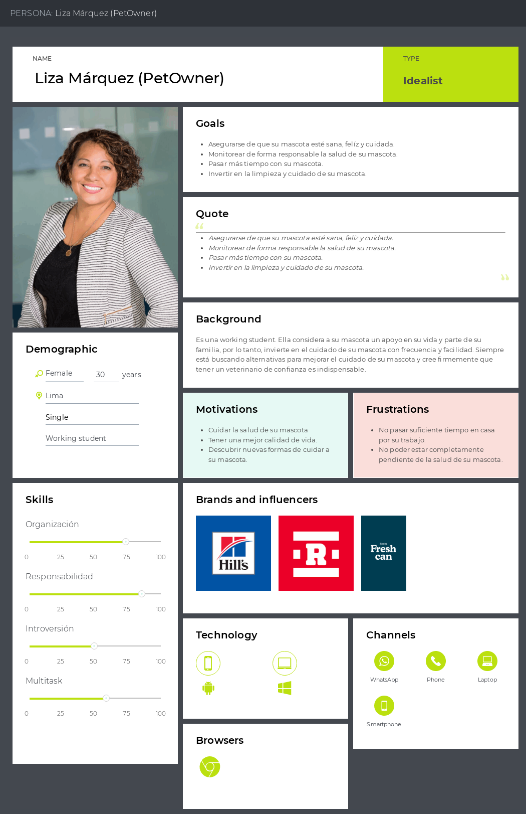
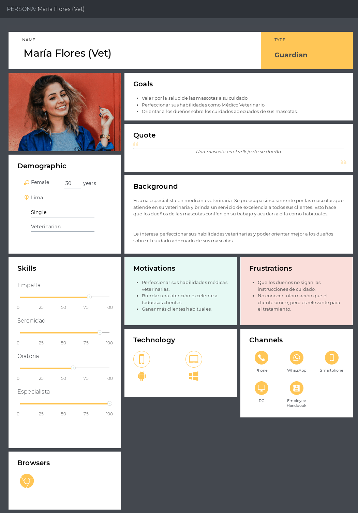
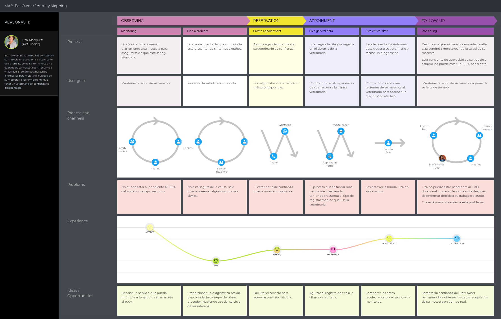
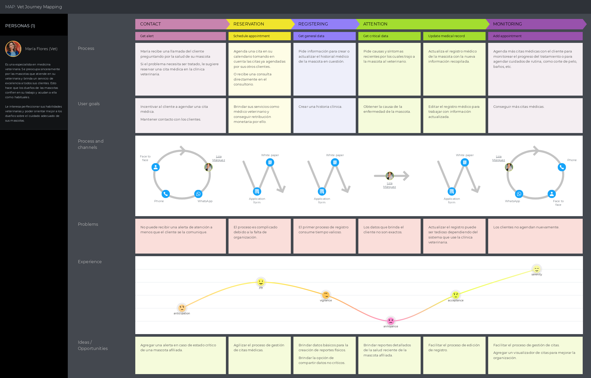
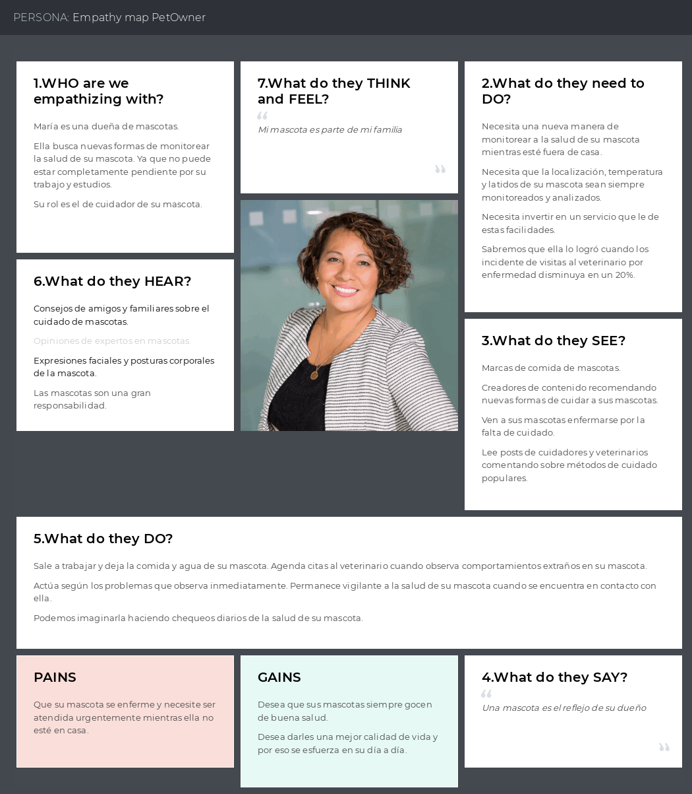
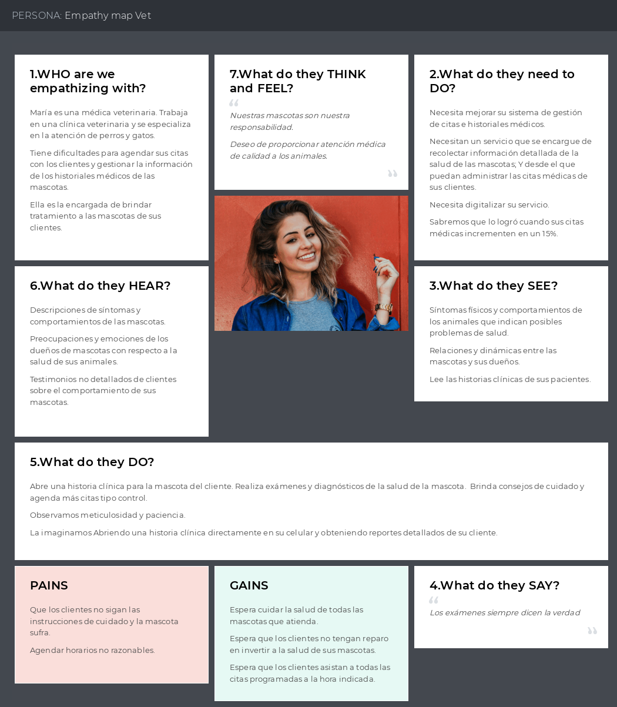
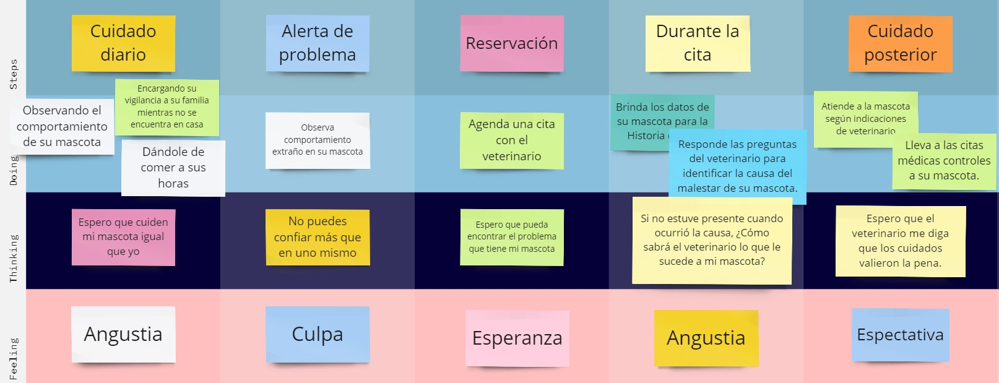
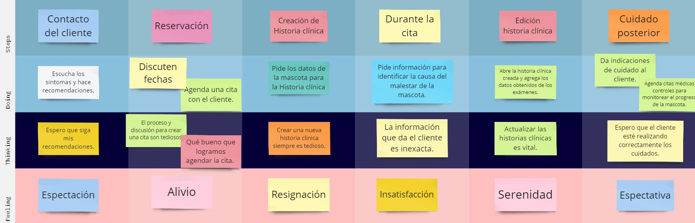

# Capítulo II: Requirements Elicitation & Analysis

## 2.1. Competidores.
### 2.1.1. Análisis competitivo.
<!-- Sección de Encabezado y Preguntas Clave -->
<table>
  <tr>
    <th colspan="2">Competitive Analysis Landscape</th>
  </tr>
  <tr>
    <td rowspan="2">¿Por qué llevar a cabo este análisis?</td>
    <td>¿Quiénes son nuestros principales competidores y que nos diferencia de ellos?</td>
  </tr>
  <tr>
    <td>Gracias al análisis de la competencia presente en el mercado podremos conocer las fortalezas y debilidades de nuestros principales competidores. Además, lograremos identificar las estrategias utilizadas por los competidores y su presencia dentro del mercado. A partir de la información recopilada en el análisis competitivo podremos plantear estrategias que nos permitan posicionarnos dentro del mercado.</td>
  </tr>
</table>

<!-- Espacio entre tablas para simular la división como en las imágenes -->
 

<!-- Sección de Análisis Competitivo -->
<table>
  <tr>
    <th colspan="2"></th>
    <th>
      

        
      

      

        PetHealth
      

    </th>
    <th>
      

        
      

      

        Invoxia
      

    </th>
    <th>
      

        
      

      

        Reachfar
      

    </th>
    <th>
      

        
      

      

        Motorola Scout 5000 
      

    </th>
  </tr>
  <tr>
    <td rowspan="2"><strong>Perfil</strong></td>
    <td>Overview</td>
    <td>Propone un collar inteligente para mascotas, diseñado para ofrecer a los dueños una forma sin precedentes de monitorear la salud de sus amigos de cuatro patas en tiempo real. Mediante el uso de sensores avanzados, el collar recopila datos críticos sobre la salud de la mascota, como la frecuencia cardíaca, la temperatura y la actividad, permitiendo un seguimiento continuo y detallado. Además de la monitorización de la salud, la aplicación proporciona una funcionalidad adicional que permite a los usuarios programar citas con veterinarias afiliadas directamente desde su dispositivo móvil.</td>
    <td>El collar inteligente de Invoxia es un dispositivo avanzado diseñado para el seguimiento de la salud y la actividad de las mascotas. Este innovador producto se enfoca en ofrecer a los dueños de mascotas una herramienta de monitoreo en tiempo real que va más allá del simple rastreo de ubicación. Con capacidades para medir la frecuencia cardíaca y la actividad física, el collar de Invoxia proporciona un enfoque integral para el cuidado de la salud de las mascotas.</td>
    <td>Es un rastreador GPS para mascotas, diseñado para proporcionar a los dueños de mascotas una forma segura y confiable de monitorear la ubicación de sus animales en tiempo real.</td>
    <td>Es un rastreador de mascotas GPS impermeable y anti-perdida con capacidades de seguimiento a través de Wi-Fi. Diseñado para ser pequeño y duradero, este dispositivo ayuda a los dueños de mascotas a mantenerse conectados con sus animales y monitorear su ubicación y bienestar.</td>
  </tr>
  <tr>
    <td>Ventaja competitiva ¿Qué valor ofrece a los clientes?</td>
    <td>Recopila datos críticos sobre la salud de la mascota, como la frecuencia cardíaca, la temperatura y la actividad, permitiendo un seguimiento continuo y detallado. Además proporciona programar citas con veterinarias afiliadas directamente desde su dispositivo móvil</td>
    <td>Ofrece una herramienta de monitoreo en tiempo real para sus mascotas, con capacidad para medir la frecuencia cardíaca y la actividad física.</td>
    <td>Rastreo GPS en tiempo real, zonas de seguridad, tiene una resistencia al agua y tiene una bateria de larga duración.</td>
    <td>Rastreo GPS en tiempo real, es imperneable y facil de usar.</td>
  </tr>
  <tr>
    <td rowspan="2"><strong>Perfil Marketing</strong></td>
    <td>Mercado Objetivo</td>
    <td>Dueños de mascotas, particularmente aquellos que valoran la salud y bienestar de sus animales, y veterinarios o clínicas.</td>
    <td>Dueños de mascotas, particularmente aquellos que valoran la salud y bienestar de sus animales</td>
    <td>Dueños de mascotas, particularmente aquellos que valoran la salud y bienestar de sus animales</td>
    <td>Dueños de mascotas, particularmente aquellos que valoran la salud y bienestar de sus animales</td>
  </tr>
  <tr>
    <td>Estrategias de marketing</td>
    <td>Campañas de publicidad pagada en redes sociales (Facebook, Instagram) dirigidas a dueños de mascotas, blogs sobre mascotas y foros, SEO para mejorar la visibilidad en búsquedas relacionadas con el cuidado de mascotas. Asociaciones con veterinarios influyentes, bloggers de mascotas y celebridades de animales en redes sociales para aumentar la credibilidad y el alcance. Participación en ferias de mascotas, conferencias veterinarias y eventos comunitarios para demostraciones en vivo y construcción de relaciones. Y anuncios en revistas de mascotas y colaboraciones con clínicas veterinarias para colocar folletos y posters.</td>
    <td>Implementar una estrategia sólida de marketing digital y redes sociales para llegar a los dueños de mascotas en línea, utilizando plataformas como Instagram y Facebook para compartir contenido educativo y atractivo sobre el cuidado de la salud de las mascotas. Desarrollar contenido útil y educativo sobre el cuidado de la salud de las mascotas, el uso de tecnología en el cuidado de mascotas, etc., para mejorar el SEO y atraer tráfico orgánico al sitio web del producto. Y introducir ofertas promocionales o descuentos para nuevos clientes para incentivar la prueba del producto</td>
    <td>Enfoque en la Seguridad y el Bienestar de las Mascotas, Demostraciones y Testimonios, Publicidad Digital, Colaboraciones y Patrocinios, SEO y Contenido de Valor, Soporte y Servicio al Cliente.</td>
    <td>Enfoque en la Seguridad y el Bienestar de las Mascotas, Demostraciones y Testimonios, Publicidad Digital, Colaboraciones y Patrocinios, SEO y Contenido de Valor, Soporte y Servicio al Cliente.</td>
  </tr>
  <tr>
    <td rowspan="3"><strong>Perfil de Producto</strong></td>
    <td>Productos & Servicios</td>
    <td>Collar inteligente para mascotas con sensores para monitorear varios indicadores de salud y aplicación móvil para seguimiento de la salud y gestión de citas veterinarias.</td>
    <td>Collar inteligente para monitorear a las mascotas, tanto su ubicación como su salud.</td>
    <td>Rastreador GPS para mascotas, diseñado para proporcionar a los dueños de mascotas una forma segura y confiable de monitorear la ubicación de sus animales en tiempo real.</td>
    <td>Rastreador de mascotas GPS impermeable y anti-perdida con capacidades de seguimiento a través de Wi-Fi</td>
  </tr>
  <tr>
    <td>Precios & Costos</td>
    <td>El precio del collar sería aproximadamente a 99$ y el costo de suscripción mensual es estimado de $10, cubriendo los servicios adicionales como el monitoreo de la salud y programar citas con veterinarias afiliadas directamente.</td>
    <td>El precio del collar es aproximadamente $99. El costo de suscripción mensual es estimado de $12.99, cubre servicios adicionales como el monitoreo de la salud y la ubicación en tiempo real.</td>
    <td>JNo se pudo encontrar el precio especifico del collar, se intuye que cuesta al rededodr de  $125</td>
    <td>Motorola Scout 5000, el precio listado es de aproximadamente $199, puede variar según el vendedor y la región</td>
  </tr>
  <tr>
    <td>Canales de distribución (Web y/o Móvil)</td>
    <td>Web y Móvil</td>
    <td>Web y Móvil</td>
    <td>Web y Móvil</td>
    <td>Web y Móvil</td>
  </tr>
  <tr>
    <td rowspan="5"><strong>Análisis SWOT</strong></td>
    <td colspan="5">Realice esto para su startup y sus competidores. Sus fortalezas deberían apoyar sus oportunidades y contribuir a lo que ustedes definen como su posible ventaja competitiva.</td>
  </tr>
  <tr>
    <td>Fortalezas</td>
    <td>Innovación Tecnológica, Integración de Salud y Ubicación, Diseño y Durabilidad, Facilidad de Uso, Compromiso con el Bienestar Animal.</td>
    <td>Innovación Tecnológica, Integración de Salud y Ubicación, Diseño y Durabilidad, Facilidad de Uso, Compromiso con el Bienestar Animal.</td>
    <td>Impermeabilidad, Funciones de Seguridad y Portabilidad.</td>
    <td>Marca Establecida, Características Avanzadas, Monitoreo en tiempo real.</td>
  </tr>
  <tr>
    <td>Debilidades</td>
    <td>Costo de Producción y Precio, Complejidad y Usabilidad, Dependencia de la Conectividad, Competencia y Diferenciación, Limitaciones de Tamaño y Raza, etc</td>
    <td>Costo, Complejidad Tecnológica, Dependencia de la Conectividad, Duración de la Batería en Comparación con la Funcionalidad, Compatibilidad y Tamaño, etc</td>
    <td>Vida de la batería, Cobertura de Red, Facilidad de Uso.</td>
    <td>Precio, Tamaño y Peso, y Complejidad.</td>
  </tr>
  <tr>
    <td>Oportunidades</td>
    <td>Expansión de Mercado, Colaboraciones y Asociaciones, Desarrollo de Productos Complementarios, Innovación Tecnológica, Educación y Conciencia, Personalización y Flexibilidad, Sostenibilidad Ambiental, Programas de Lealtad y Referencia, Expansión a Servicios de Salud Integrados, y Adaptabilidad a Diferentes Tipos de Mascotas</td>
    <td>Expansión de Mercado, Alianzas Estratégicas, Innovación de Productos, Personalización y Accesorios, Educación y Concientización, Integración con Otros Servicios, Sostenibilidad y Responsabilidad Social, y Expansión del Ecosistema Digital</td>
    <td>Expansión de Mercado, Colaboraciones, Desarrollo de Productos</td>
    <td>Innovación de Productos, Expansión del Mercado, Marketing y Asociaciones.</td>
  </tr>
  <tr>
    <td>Amenazas</td>
    <td>Intensa Competencia, Cambios Rápidos en la Tecnología, Sensibilidad al Precio de los Consumidores, Regulaciones y Normativas, Problemas de Conectividad y Dependencia Tecnológica, Preocupaciones de Seguridad y Privacidad de Datos, Reputación y Calidad del Producto, Impacto Económico y Cambios en el Comportamiento del Consumidor, Falsificaciones y Competencia Desleal, y Desafíos de Distribución y Logística</td>
    <td>Competencia Intensa, Avances Tecnológicos Rápidos, Sensibilidad al Precio, Cuestiones Regulatorias y de Privacidad, Dependencia Tecnológica y de Conectividad, Cambios en el Comportamiento del Consumidor, Problemas de Calidad y Seguridad del Producto, Impacto Económico Global, Falsificaciones y Competencia Desleal, y Desafíos de Distribución y Cadena de Suministro</td>
    <td>Competencia Intensa, Cambios Tecnológicos, Sensibilidad al Precio.</td>
    <td>Alternativa de Bajo Costo, Desarrollo Tecnológico Rápido, Problemas de Privacidad y Seguridad.</td>
  </tr>
</table>

### 2.1.2. Estrategias y tácticas frente a competidores.
En base al análisis competitivo de nuestros competidores que elaboramos previamente, hemos identificado las fortalezas, debilidades, oportunidades y amenazas de nuestros competidores. Donde aplicaremos estrategias y tácticas para afrontarlo.

**Afrontando las fortalezas de nuestros competidores**  
Las fortalezas de nuestra competencia se comprenden en:
1. Innovación y Mejora Continua:
  - Competidores: Muchos ofrecen seguimientos GPS y monitoreo básico.
  - Estrategia: Ir más allá del estándar; investigar y desarrollar características innovadoras que nuestros competidores no ofrezcan, como análisis de comportamiento avanzado, recomendaciones personalizadas para el cuidado de la mascota, o integración con dispositivos de hogar inteligente.
2. Experiencia de Usuario:
  - Competidores: Las aplicaciones y dispositivos pueden ser complicados o no muy intuitivos.
  - Estrategia: Asegúrarse de que nuestro producto y aplicación sean extremadamente fáciles de usar, con interfaces intuitivas y soporte al cliente excepcional. Considerando la implementación de tutoriales interactivos o realidad aumentada para ayudar en la configuración inicial.
3. Personalización:
  - Competidores: Ofrecen soluciones más generalizadas.
  - Estrategia: Proporcionar opciones de personalización avanzadas, permitiendo a los dueños de mascotas ajustar las funciones según las necesidades específicas de sus animales. Esto puede incluir alertas personalizadas, objetivos de actividad y planes de salud personalizados.
4. Precios y Modelos de Suscripción:
  - Competidores: Algunos pueden tener precios elevados o modelos de suscripción costosos.
  - Estrategia: Ofreceremos un modelo de precios competitivo o flexible que pueda atraer a un rango más amplio de clientes. Considerando ofrecer una versión básica gratuita con opciones de suscripción premium para características avanzadas.
5. Marketing y Comunidad:
  - Competidores: Pueden tener estrategias de marketing sólidas y reconocimiento de marca.
  - Estrategia: Construir una comunidad fuerte alrededor de nuestra marca, utilizando las redes sociales y marketing de contenido para educar a los dueños de mascotas sobre la importancia del cuidado preventivo. Las historias de éxito de clientes reales pueden ser particularmente poderosas.
6. Asociaciones Estratégicas:
  - Competidores: Pueden tener asociaciones establecidas con clínicas veterinarias o tiendas de mascotas.
  - Estrategia: Buscaremos asociaciones únicas, como colaborar con organizaciones de bienestar animal, grupos de entrenamiento de mascotas, o incluso aseguradoras de mascotas para ofrecer paquetes exclusivos o descuentos.
7. Sostenibilidad:
  - Competidores: La sostenibilidad puede no ser su enfoque principal.
  - Estrategia: Destacaremos cualquier aspecto ecológico de nuestro producto, como materiales sostenibles o empaques reciclables, y asegurarnos de comunicar estas iniciativas a tus clientes.

**Aprovechando las debilidades de nuestros competidores**  
Las debilidades de nuestra competencia se comprenden en:
1. Mejora la Durabilidad y Comodidad:
  - Competidores: Algunos collares pueden ser frágiles o incómodos para las mascotas.
  - Estrategia: Aseguraremos que el PetHealth sea robusto y resistente al agua, pero también ligero y cómodo para llevar todo el día. Destacaremos estas características en tu marketing.
2. Simplifica la Experiencia del Usuario:
  - Competidores: Interfaces complicadas o configuraciones difíciles.
  - Estrategia: Ofreceremos una experiencia de usuario intuitiva tanto en el dispositivo como en la app asociada. Implementando un diseño amigable y asegurarse de que la configuración sea simple, ofreciendo guías paso a paso o videos tutoriales.
3. Optimiza la Vida de la Batería:
  - Competidores: Corta duración de batería que requiere cargas frecuentes.
  - Estrategia: Desarrollaremos tecnología de batería de larga duración y destacar este punto en nuestra comunicación. Considerando sistemas de ahorro de energía inteligentes que ajusten el uso según la actividad.
4. Ofrece Precios Competitivos y Flexibles:
  - Competidores: Precios altos o estructuras de suscripción costosas.
  - Estrategia: Evaluaremos nuestra estructura de costos para ofrecer precios competitivos o modelos de suscripción más flexibles que atraigan a una base de clientes más amplia.
5. Proporciona Soporte al Cliente Excepcional:
  - Competidores: Servicio al cliente deficiente o limitado.
  - Estrategia: Estableceremos un soporte al cliente excepcional, ofreciendo múltiples canales de soporte, como chat en vivo, email, y teléfono. Respondiendo rápidamente a las consultas y solucionando problemas de manera eficiente.
6. Enfócate en la Seguridad de Datos:
  - Competidores: Preocupaciones sobre la privacidad y seguridad de los datos.
  - Estrategia: Implementaremos y comunicaremos claramente las medidas de seguridad de datos avanzadas para proteger la información personal y de salud de las mascotas. Esto puede incluir encriptación de datos, políticas de privacidad transparentes y opciones de control de datos para los usuarios.
7. Capacita y Educa a Tus Usuarios:
  - Competidores: Falta de información o educación sobre el uso y beneficios del producto.
  - Estrategia: Crearemos contenido educativo que destaque los beneficios de monitorear la salud y la actividad de las mascotas. Utilizando blogs, vídeos y redes sociales para educar a los dueños sobre cómo nuestro producto puede mejorar la vida de sus mascotas.
8. Innovación Constante:
  - Competidores: Falta de innovación o actualizaciones.
  - Estrategia: Nos compremeteremos a la innovación continua, desarrollando nuevas características y mejoras basadas en el feedback de los usuarios. Manteniendo a tus clientes comprometidos con actualizaciones regulares y nuevas funcionalidades.

**Afrontando las oportunidades de nuestros competidores**  
Las oportunidades de nuestra competencia se comprenden en:
1. Innovación Constante:
  - Competidores: Lanzamiento de nuevas funciones y mejoras.
  - Estrategia: Fomentaremos una cultura de innovación continua en tu startup. Manteniendo al tanto de las tendencias emergentes en tecnología para mascotas y bienestar animal. Considerando la implementación de funciones avanzadas antes que tus competidores, como análisis de comportamiento mediante inteligencia artificial o integración con otros dispositivos inteligentes del hogar.
2. Expansión de Mercado:
  - Competidores: Entrar en nuevos mercados geográficos o segmentos de clientes.
  - Estrategia: Realizaremos investigaciones de mercado para identificar nichos no explotados o mercados emergentes. Considerando asociaciones locales o regionales para facilitar la entrada a nuevos mercados. Adaptando nuestro producto y mensajes de marketing para resonar con las preferencias locales.
3. Asociaciones Estratégicas:
  - Competidores: Colaboraciones con veterinarios, tiendas de mascotas, o influencers del ámbito pet-friendly.
  - Estrategia: Buscar asociaciones únicas que puedan ofrecer un valor añadido distintivo. Esto podría incluir alianzas con organizaciones de rescate de animales, colaboraciones con desarrolladores de aplicaciones de fitness para humanos que quieran incluir a sus mascotas, o programas de fidelidad conjuntos con marcas de alimentos para mascotas.
4. Educación y Conciencia:
  - Competidores: Campañas para educar a los dueños de mascotas sobre la salud y el bienestar animal.
  - Estrategia: Desarrollaremos contenido educativo que posicione a nuestra marca como líder en el cuidado de mascotas. Organizando webinars, talleres y colaboraciones con expertos en el cuidado de mascotas para crear guías y consejos prácticos. Utilizando historias reales de clientes para mostrar cómo tu producto ha hecho una diferencia.
5. Experiencia Personalizada:
  - Competidores: Ofrecer productos o servicios personalizados.
  - Estrategia: Utilizaremos tecnología para personalizar la experiencia del usuario, desde la personalización del producto hasta recomendaciones personalizadas basadas en el análisis de datos de la actividad de la mascota. Consideraremos funciones ajustables que los dueños puedan modificar según las necesidades específicas de sus mascotas.
6. Sostenibilidad y Responsabilidad Social:
  - Competidores: Enfatizar prácticas de negocio sostenibles y responsables.
  - Estrategia: Aseguraremos de que nuestra cadena de suministro sea sostenible y ética. Considerando la posibilidad de participar en programas de reciclaje para dispositivos antiguos y utiliza materiales eco-amigables. Comunicando nuestros esfuerzos y compromisos de sostenibilidad claramente a tus clientes.
7. Adaptabilidad y Escalabilidad:
  - Competidores: Flexibilidad para adaptarse rápidamente a los cambios del mercado.
  - Estrategia: Mantendremos nuestra estructura organizativa ágil para poder adaptartarnos rápidamente a los cambios en las demandas de los consumidores o a los desafíos del mercado. Fomentando un enfoque basado en datos para la toma de decisiones, lo que nos permitirá escalar eficazmente y ajustar nuestras estrategias en tiempo real.
8. Enfoque en la Comunidad:
  - Competidores: Construir una comunidad sólida y comprometida.
  - Estrategia: Crearemos una comunidad en línea y fuera de línea entorno a nuestra marca, ofreciendo un espacio para que los dueños de mascotas compartan experiencias, consejos y apoyo. Organizando eventos comunitarios y participando en causas relacionadas con el bienestar animal.

**Aprovechando las amenazas de nuestros competidores**  
Las amenazas de nuestra competencia se comprenden en:
1. Cambios Tecnológicos Rápidos:
  - Competidores: La rápida evolución tecnológica puede hacer que sus productos queden obsoletos.
  - Estrategia: Mantendremos una estrategia de innovación continua que te permita adaptarte rápidamente a los cambios tecnológicos. Invertiremos en investigación y desarrollo para asegurar que nuestro producto siempre esté a la vanguardia, utilizando las últimas tecnologías disponibles.
2.  Intensa Competencia:
  - Competidores: Un mercado cada vez más saturado.
  - Estrategia: Nos diferenciaremos a través de la personalización y el servicio al cliente. Ofreceremos características únicas que no están disponibles en otros productos y crearemos una experiencia de cliente excepcional que fomente la lealtad a la marca.
3. Sensibilidad al Precio de los Consumidores:
  - Competidores: Los consumidores pueden ser reacios a gastar en productos premium.
  - Estrategia: Desarrollaremos una estructura de precios flexible con diferentes puntos de entrada para acomodar a una variedad de consumidores. Considerando ofrecer un modelo básico con la opción de agregar características premium a través de suscripciones.
4. Regulaciones y Normativas:
  - Competidores: Cambios en la regulación pueden afectar la operatividad de los productos.
  - Estrategia: Mantendremos informado sobre las regulaciones actuales y futuras en todos los mercados en los que operamos. Aseguraremos que nuestro producto cumpla o supere estos estándares, y utilizaremos el cumplimiento como un punto de venta.
5. Preocupaciones sobre Privacidad y Seguridad de Datos:
  - Competidores: La gestión de datos sensibles puede generar preocupaciones.
  - Estrategia: Implementaremos protocolos de seguridad de datos de primer nivel y comunicaremos abiertamente nuestras prácticas de privacidad a nuestros clientes. Consideraremos obtener certificaciones de seguridad que puedan tranquilizar a los consumidores.
6. Impacto Económico Global:
  - Competidores: Una economía global inestable puede disminuir el gasto de los consumidores.
  - Estrategia: Ofreceremos un valor excepcional y demostraremos cómo nuestro producto puede ser una inversión a largo plazo en la salud y bienestar de la mascota. Consideraremos programas de pago flexibles o financiamiento para hacer nuestro producto más accesible.
7. Falsificaciones y Competencia Desleal:
  - Competidores: La presencia de productos falsificados en el mercado.
  - Estrategia: Educaremos a nuestros clientes sobre cómo identificar tu producto auténtico y las ventajas de comprar directamente de nosotros o de distribuidores autorizados. Protegeremos nuestra marca y nuestros productos mediante patentes y marcas registradas.
8. Desafíos de Distribución y Cadena de Suministro:
  - Competidores: Interrupciones en la cadena de suministro pueden afectar la disponibilidad del producto.
  - Estrategia:  Desarrollaremos una cadena de suministro robusta y flexible con múltiples proveedores y opciones logísticas. Consideraremos la producción local o regional para reducir los tiempos de entrega y los costos.

## 2.2. Entrevistas.
### 2.2.1. Diseño de entrevistas.
#### Preguntas generales:
- ¿Cuál es su nombre completo?
- ¿Cuál es su edad?
- ¿Dónde vive actualmente?
- ¿Cuál es su grado académico?
- ¿Cuál es el dispositivo móvil que más usa? 
- ¿Cuál es el sistema operativo de su celular? (Android/iOS)
- ¿Cómo se ve en 5 años?
- ¿Qué navegador web usa?
- ¿Qué redes sociales usa?

#### Dueños / Cuidadores de mascotas
- ¿Cuántas mascotas tiene?
- ¿De qué especie son?
- ¿Cuáles son los pasos de su rutina para asegurar la salud de su mascota?
- - ¿Qué le frustra de ser dueño de una mascota?
- ¿Su mascota recibe algún tratamiento?
- ¿Hay algún síntoma al que deba estar atento/atenta?
- ¿Cómo lidia con este escenario cuando usted está fuera de casa?
- ¿Tiene un veterinario de confianza? *Si la respuesta es positiva o negativa:* ¿Cómo agenda las citas de su mascota con su veterinario?
- ¿Cada cuánto tiempo agenda estas citas para su mascota? ¿Cuál es el motivo?
- ¿Cómo lleva el registro médico de su mascota? ¿Usa o conoce a alguien que use alguna aplicación que sea de ayuda?
- ¿Si tuviera una emergencia y no pudiera acudir a su veterinario de confianza, cuál cree que sería su principal problema?
- Que le motivó a conseguir una mascota?
- ¿Qué problemas tiene respecto al cuidado de su mascota?
- ¿Qué marcas de dispositivos usa regularmente en su mascota? (marcas de croquetas, collares, medicinas, etc.)
- ¿Cuántos años de experiencia tiene como dueño de mascota?
- ¿Cómo se comunica con sus veterinarios?

#### Médicos Veterinarios
- ¿Qué lo motivó a ser medico veterinario?
- ¿Qué problemas tiene siendo un medico veterinario?
- ¿Qué marcas de dispositivos usa regularmente en su trabajo? (Marcas de Vacunas, de medicamentos, etc.)
- ¿Cuántos años de experiencia tiene como veterinario?
- ¿Cómo se comunica con sus clientes?
- ¿Cuál es la especie de mascotas que más atiende?
- ¿Cuántos clientes regulares tiene aproximadamente?
- ¿Cuál es el principal motivo de las visitas al veterinario?
- ¿Cáda cuánto tiempo es recomendable que una mascota visite al veterinario?
- ¿Cómo llevan el registro médico de las mascotas?
- ¿Cuáles son las diferencias entre un procedimiento de emergencia para un cliente regular y para un cliente nuevo? (Ejemplo: Un caso de envenenamiento)

### 2.2.2. Registro de entrevistas.

**Segmento: Dueños de mascota**

- Entrevista 1:  
Entrevistador: Saúl Mendoza  
Entrevistado: Nataly Torres  
Edad: 23  
Link de la entrevista: https://www.youtube.com/watch?v=L07RnsSHmFw 

- **Resumen**: Nataly es una dueña de mascota de 23 años, que vive en Callao, usa principalmente Android. Nos comenta que tiene un veterinario de confianza al cual acude al menos 1 o 2 veces al mes, ya sea para un chequeo a su mascota o para un baño, corte de pelo de su mascota, también nos cuenta que cuando no está en casa, suele dejar a su mascota con algún familiar o amigo de confianza. Le gustaría una aplicación que le ayude a administrar los chequeos de su mascota para tener datos y estado medico de su mascota para de esa manera agilizar el proceso y tener un diagnóstico en caso algo llegue a suceder. 

- Entrevista 2:
Nombre: Beatriz Almora Chuquihuaccha
Distrito de residencia: Independencia
Edad: 56 años
Grado académico: Técnico

- **Resumen**: Beatriz es una dueña de mascota de 56 años. Vine en Independencia y el dispositivo que más usa es el celular con sistema operativo Android. El navegador que más utiliza en Chrome. Las redes sociales que más usa son Whatsapp, Facebook y TikTok. Tiene 3 mascotas, 2 perros y un gato. Se preocupa en llevar la cuenta de los baños de sus mascotas y en la compra de sus alimentos. No le molesta cuidar a sus mascotas porque sabe que ellos son dependientes de ella. Tiene problemas respecto a la salud de sus mascotas. Ella no puede monitorear a sus mascotas por largos periodos de tiempo debido al trabajo, en estos casos, ella encarga su cuidado a su hojo.
Tiene un veterinario de confianza, donde realiza los baños, cortes de pelo, despulgue y revisiones médicos. Ella agenda sus citas cada 25 días y por llamada o whatsapp, donde coordinan la hora que necesite. Ella lleva la cuenta de las veces que lleva a sus mascotas al veterinario viendo la longitud del pelo de su perro. 
Si su veterinario de confianza no estubiera disponible, buscaría otro veterinario disponible, lo cual le resultaría tedioso. 
LAs marcas que usa son croquetas Ricocán, croquetas recomendadas por el veterinario (no recuerda el nombre) y shampoo Fresh Can. 
Tiene 4 años siendo dueña de mascotas.

**Segmento: Veterinarios**
- Entrevista 1:  
Nombre: Cindia Martinez Olivia
Edad: 37 años
Distrito de residencia: Breña
Grado Académico: Médico Veterinario

  - **Resumen**:
    Cindia es una veterinaria de 37 años, que vive en Breña, usa principalmente Iphone iOS. En su trabajo, el animal que más atiende son los perros y lo traen al veterinario mayormente por enfermedades, tanto por su salud o edad. La cantidad de clientes que llegan cuando está en su turno es entre 10 a 12 clientes aproximadamente.  
    Cuenta que se debe llevar al veterinario a sus mascotas por lo menos 1 vez al mes. Manejan un software llamado MedPet, donde ingresan todos los datos de sus anteriores clientes, la salud de sus mascotas, el historial médico, como también la fecha del proximo baño de pulgas de la mascota. Las diferencias entre un procedimiento de emergencia para un cliente regular y para un cliente nuevo, según la doctora, para un cliente regular, es más fácil saber que es lo que tiene el animal, se obvia mucho procedimiento ya que tiene registrado sus anteriores enfermedades y puede calcular que es lo que tiene el animal, miéntras que un cliente nuevo, se tiene que realizar todos los examenes para saber exactamente que enfermedad tiene el animal.

- Entrevista 2:
Nombre: Grecia Elena Álvarez Medrano
Edad: 33 años
Distrito de residencia: Carabayllo
Grado académico: Médico Veterinario

- **Resumen**:
Grecia es una veterinaria de 33 años que vive en Carabayllo. El dispositivo que más usa es el celular con sistema operativo Android. Tiene una especialización en perros y gatos, que son los animales que más atiende. Atiende de 8 a 10 animales por día. Los pricipales motivos de las consultas son: inapentencia, fiebre o tienen garrapatas. Ella recomienda que las mascotas recivan citas veterinas según su edad: los más jóvenes cada año y a partir de los 5 años, 2 veces por año.
Utiliza historias clínicas físicas para llevar los registros médicos de las mascotas que atiende. Pero espera en un futuro virtualizar este proceso. El procedimiento para la atención de una mascota es: Ingresar a recepción, crear una historia clínica física o buscar su historia existente, y ser atendidos. Todas las mascotas deben aperturar una historia clínica.

- Entrevista 3:
Nombre: Henry Nicolas Velarde Bernales
Edad: 24 años
Distrito de residencia: Lima
Grado académico: Estudiante Veterinario

- **Resumen**:
La entrevista realizada a Henry Nicolas Velarde Bernales un joven veterinario de 24 años, nos comenta que actualmente vive en Lima, actualmente se encuentra estudiando y trabajando, el dispositivo que más usa es el celular, con el sistema operativo de Android, en 5 años se ve teniendo su propia veterinaria y ayudando a varios animalitos en la calle. El navegador web que mas usa es el chrome, y la red social que más utiliza son WhatsApp y Facebook. El nos comenta que le gustan muchos los animales y le gusta ayudar.Henry nos comenta que las mascotas que mas atiende son perros y gatos, mas perros que gatos. A diario el recibe 7 u 8 clientes diarios, de los cuales la mayoria de visitas que recibe son por que sus mascotas se encuentran mal. El recomienda que las mascotas deben acudir al veterinario minimo 2 veces al año, para un chequeo, en caso no se presente ninguna enfermedad y pueda prevenir una enfermdad a largo plazo.Henry comenta que en la veterinaria donde trabaja mantienen los registrso de las mascotas en word y tambien en documentos fisicos. Nos comentó también como proceden ante un caso comun que ve a diario y uno de emergencia. En el caso común, es que llevan a la mascota por alergia, el veterinario lo chequea y le da su respectiva receta. Para el caso de emergencia, primero deben calmar al dueño, para que puedan hablar con el y les pueda dar mas detalles sobre lo que le sucede a la mascota,una vez identificado las causas, el veterinario procede con los respectivos protocolos para la pronta mejora de la mascota. Por ultimo acota que es muy importante una comunicacion clara con los dueños de las mascotas, ya que si no llegan a entenderse bien, el veterinario le puede estar aplicando una medicina que no es lo ideal para el caso que esta presentando la mascota.

### 2.2.3. Análisis de entrevistas.
#### Pet Owners
- La edad promedio de los Pet Owners es 34 años.
  
- El 100% de los Pet Owners viven en Lima.
  
- El dispositivo peferido de los pert Owners es el Smartphone
  
- El Sistema operativo más usado es Android.
  
- El navegador web más usado es Chrome.
  
- Redes sociales:
  
- El promedio de la cantidad de mascotas que tienen es 3
  
- Las especies de mascotas que tienen:
  
- El 100% tiene un veterinario de confianza
  
- Los Pet owners llevan a sus mascotas al veterinario cada 26 días en promedio
  
- Canales de comunicación con sus veterinarios:
  

#### Vets
- La edad promedio de los Vets es 31 años.
  

- El 100% de los Vets entrevistados viven en Lima.
  
- El dispositivo más usado por los Vets es el Smartphone.
  
- El 66.6% usa Android frente al 33.3% restante.
  
- Redes sociales:
  
- Especies atendidas:
  
- Los Vets atienden a 10 clientes diarios en promedio.
  
- El principal motivo de las consultas es por enfermedades.
  
- La fecuencia recomendada de las visitas es 2 por año.
  
- Sistemas usados por las clínicas veterinarias:
  

[Enlace a excel](https://upcedupe-my.sharepoint.com/:x:/g/personal/u20201c163_upc_edu_pe/EfvlPHpUGshHs-7rN9eOosMBJX_-CRykCce26yLYVVHufg?e=TYyfqn)

## 2.3. Needfinding.
### 2.3.1. User Personas.
- Dueños de mascotas:

[UxPressia](https://uxpressia.com/w/4rB9D/p/MUnXl)
- Médicos veterinarios:

[UxPressia](https://uxpressia.com/w/4rB9D/p/rJ76I)
### 2.3.2. User Task Matrix.
|                       Task Matrix                     |  Pet Owner |  Pet Owner  |     Vet    |     Vet     |
|:-----------------------------------------------------:|:----------:|:-----------:|:----------:|:-----------:|
|                                               | Frecuencia | Importancia | Frecuencia | Importancia |
|     Monitorización en tiempo real y análisis de salud |    Alta    |     Alta    |    Media   |     Alta    |
|                  Alerta de estado anormal             |    Baja    |     Alta    |    Baja    |     Alta    |
|         Reservación de cita en clínica veterinaria    |    Media   |     Alta    |    Media   |     Alta    |
|                 Asignación de diagnóstico             |    Media   |    Media    |    Media   |    Media    |
|           Edición   de Información de Mascota         |    Baja    |     Alta    |    Alta    |     Alta    |
|         Gestión   de historia clínica de salud        |    Media   |     Alta    |    Alta    |     Alta    |
|                  Gestión   de clientes                |      -     |      -      |    Alta    |    Media    |
|             Gestión   de historial de citas           |    Media   |     Baja    |    Alta    |    Media    |
|             Recordatorio   de citas médicas           |   Media    |    Media    |    Media   |     Baja    |
|             Calificación a Veterinarias               |    Baja    |     Alta    |      -     |      -      |

#### Leyenda:
Frecuencia:
- Alta: Se realiza de forma frecuente.
- Media: Se realiza de forma medianamente frecuente.
- Baja: Se realiza esporádicamente / no se realiza.
#### Importancia:
- Alta: La tarea es esencial para el usuario y debe ser realizada sin dificultades.
- Media: La tarea es importante, pero puede haber cierto grado de flexibilidad en la ejecución.
- Baja: La tarea no es crítica y puede haber margen para la simplificación o automatización.

### 2.3.3. User Journey Mapping.
- Dueños de mascotas:

[UxPressia](https://uxpressia.com/w/4rB9D/m/RQ7Y9)
- Médicos veterinarios:

[UxPressia](https://uxpressia.com/w/4rB9D/m/KXGlg)
### 2.3.4. Empathy Mapping.
- Dueños de mascotas:

[UxPressia](https://uxpressia.com/w/4rB9D/p/i8qXM)
- Médicos veterinarios:

[UxPressia](https://uxpressia.com/w/4rB9D/p/qYdfL)
### 2.3.5. As-is Scenario Mapping.
- Dueños de mascotas:

[Miro](https://miro.com/app/board/uXjVKVSc_10=/?share_link_id=389082642088)
- Médicos veterinarios:

[Miro](https://miro.com/app/board/uXjVKVSc_10=/?share_link_id=389082642088)

## 2.4. Ubiquitous Language.
* **PetHealth:** Se refiere a la aplicación que yace en los dispositivos de los usuarios.
* **Control panel:** Se refiere a la interfaz de usuario dentro de la aplicación PetHealth donde los Pet Owners pueden visualizar y gestionar la información relacionada con la salud y bienestar de sus mascotas.
* **Pet Owner:** Se refiere al dueño de una mascota. 
* **PetHealt Collar:** Se refiere al collar, ofrecido por PetHealth, que servirá para monitorear la salud de la mascota y facilitar un reporte de estado al Pet Owner.
* **Pet:** Se refiere a la mascota que usa el PetHealth Collar.
* **Vet:** Se refiere al veterinario afiliado a la aplicación PetHealth.
* **Your Vets:** Se refiere al listado de Vets a los que los Pet owners se encuentran afiliados, con los que comparten información de su mascota.
* **In person Appointment:** Se refiere a la cita médica agendada haciendo uso de la aplicación PetHealth entre el Pet Owner y el Vet. 
* **Online Review:** Se refiere a la consulta médica en línea realizada al Vet a travéz de la aplicación.
* **Pet Report:** Se refiere al reporte que solicita la información médica recopilada de Pet. Puede ser solicitada por el Pet Owner y el Vet al que el Pet Owner se ha afiiado.
* **Pet Medical History:** Se refiere al registro completo de la salud y tratamientos médicos de la mascota, almacenado y gestionado dentro de la aplicación PetHealth. 
* **Notifications:** Se refiere a las alertas y notificaciones enviadas directamente a la aplicación del Pet Owner para informar sobre eventos importantes, como recordatorios de citas o reportes de estado.
* **Pet warning:** Se refiere a la notificación enviada a la aplicación del Pet Owner que informa un estado anormal en los signos vitales o ubicación de Pet.
* **Subscription plans:** Se refiere a las diferentes opciones de membresía o planes de suscripción ofrecidos a los Pet Owners para acceder a las funcionalidades premium de la aplicación PetHealth.
* **Pet Registration:** Se refiere al proceso mediante el cual un Pet Owner registra a su mascota en la aplicación PetHealth, incluyendo detalles como nombre, raza, edad, y otros datos relevantes.
* **Collar integration:** Se refiere a los pasos requeridos para sincronizar el nuevo PetHealth collar a la aplicación del Pet Owner.
* **Client support:** Se refiere al servicio activo que atiende y busca resolver las inquietudes y problemas de los usuarios.
* **Software updates:** Se refiere a las mejoras y correcciones de errores realizadas en la aplicación PetHealth para garantizar su rendimiento óptimo y mantenerla actualizada con las últimas tecnologías y estándares de seguridad.
