# Capítulo V: Solution UI/UX Design
## 5.1. Style Guidelines.
Se presentan las bases del repositorio central y organizado de uso común para todo el equipo con el fin de mantener una presentación consistente. Se incluye secciones para General Style Guidelines, Web Style Guidelines y Mobile Style Guidelines.
### 5.1.1. General Style Guidelines.
Para la elaboración de la guía de estilos de PetHealth nos valeremos de:
- Misión:
Revolucionar la atención y el bienestar de las mascotas mediante la innovación tecnológica. Nos esforzamos por proporcionar a los propietarios de mascotas una herramienta **intuitiva y avanzada** que les permita monitorear y gestionar la salud de sus animales con **facilidad y precisión**.
- Visión:
Establecernos como líderes globales en la salud y bienestar de mascotas, definiendo nuevos estándares de cuidado animal a través de la **tecnología**. Aspiramos a crear una comunidad donde cada mascota pueda vivir su vida más saludable y feliz, mientras proporcionamos **tranquilidad y soporte continuo** a sus dueños. Nos imaginamos transformando la industria del cuidado de mascotas, haciendo que el acceso a la atención médica preventiva y de calidad sea más **accesible** que nunca.
- Público objetivo: 
Dueños de mascotas de entre 17 y 60 años y Veterinarios de entre 30 a 50 años. 
- Personalidad de la marca: 
Buscamos fomentar un mundo donde cada mascota reciba el cuidado y la atención que merece. 
- Valores fundamentales de la marca:
Honestidad, lealtad, seguridad y calidad.

Teniendo en cuenta que nuestros usuarios utilizarán la aplicación para monitorear datos críticos de salud de sus mascotas o pacientes a traves de un Gadget tecnológico, PetHealth adoptará un tono formal, respetuoso y sereno.  
Del mismo modo, se probará la eficacia o el gusto de los usuarios por la aplicación a través de los comentarios de reseña de los clientes satisfechos.  
  
El color principal es el celeste ya que es un color que se relaciiona con la modernidad y la medicina. Se agregó un collar en el logo para recalcar la solución IoT.
  
 
Se eligió Montserrat por su alta legibilidad, facilidad de escalado y fácil lectura en dispositivos electrónicos.
  
De la misma manera, se eligió Work Sans por su correcto espaciado y su fácil lectura en dispositivos electrónicos. 

##### Inclusive design: 
Ya que detro de nuestro público objetivo se encuentran a usuarios de edad avanzada, es necesario elegir fuentes distingibles y además, no presentar secciones demasiado pequeñas en las soluciones nuestro servicio debe ser accesible a ellos. Las pautas consideradas son:
- Colores contrastantes y fuentes distinguibles para los usuarios con problemas de 
visión.
- Se usaron plantillas para cumplir con los patrones de diseño comunes __(consistencia externa)__.
- Imágenes de gran tamaño y calidad __(Responsive images)__.
### 5.1.2. Web, Mobile and IoT Style Guidelines.
- Consistencia: Las pautas de diseño deben seguirse en todas las soluciones presentadas.
- Priorización de contenido:  Indica a usuario cuáles son las funciones más relevantes dentro de la aplicación mediante la Sidebar (Web Application) y la Bottom Navigation (Movile Application)
- Facilita la interacción (Fuentes distinguibles y de tamaño considerable).
- Colores contrastantes.
#### Web Style Guidelines:

- Estructura el contenido: Estilo Dashboard
- Adapta la web a todo tipo de dispositivos (Responsive).  

#### Mobile Style Guidelines:
- Considera gestos y entradas de voz.
- Permite magnificar.

#### IoT Style Guidelines:
- Solo se considera un dispositivo IoT: PetHealth Collar, que es comprado y sincronizado por el usuario Pet Owner. 
- PetHealth Collar no cuenta con interface. Se sincroniza a través de la aplicación móvil, donde se observan los datos recopilados.

## 5.2. Information Architecture.
### 5.2.1. Organization Systems.

En nuestra estrategia de organización del contenido, aplicaremos diferentes sistemas según la naturaleza y el propósito de la información. Esto asegurará una experiencia de usuario coherente y eficiente. A continuación, detallamos cómo utilizaremos los distintos enfoques:
#### Organización Visual del Contenido:  

- **Jerárquica** (Visual Hierarchy):  
Utilizaremos este enfoque cuando sea necesario establecer una estructura clara de prioridades o niveles de importancia. Por ejemplo, en la página de inicio, destacaremos los elementos de manera prominente, seguidos de elementos secundarios a la derecha (Dashboard).
- **Organización Secuencial** (Step-by-Step):  
Implementaremos esta organización para guiar a los usuarios a través de procesos o tareas específicas. Por ejemplo, en creaciones de citas o procesos de pago.
- **Matricial**:  
Reservaremos este enfoque para situaciones en las que la información pueda organizarse de manera multidimensional o interrelacionada. Por ejemplo, en los calendarios, utilizaremos una disposición matricial para permitir la fácil exploración y comparación de datos de las citas del usuario.

#### Esquemas de Categorización de Contenido:

- **Alfabético:**  
Emplearemos este esquema cuando la información pueda organizarse de manera eficiente mediante un orden alfabético. Por ejemplo, en listas de veterinarios, cinicas o mascotas, ordenaremos los elementos según su orden alfabético para facilitar la búsqueda y la referencia.
- **Cronológico:**
Optaremos por este esquema cuando sea relevante mostrar la información en orden temporal. Por ejemplo, en listas de documentos o reportes presentaremos los elementos en orden cronológico para proporcionar contexto y seguimiento.
- **Por Tópicos:**  
Utilizaremos esta categorización para agrupar la información según temas o categorías específicas. Por ejemplo, en sitios de contenido educativo o bibliotecas digitales, organizaremos los recursos según los temas relevantes para facilitar la búsqueda y la exploración. 

Al aplicar estos sistemas de organización de manera estratégica, garantizaremos una experiencia de usuario intuitiva y satisfactoria, facilitando la búsqueda, la navegación y la comprensión del contenido.
### 5.2.2. Labeling Systems.
#### Sistemas de Etiquetado

En nuestra estrategia de etiquetado, priorizamos la simplicidad y la claridad para evitar confusiones entre nuestros usuarios. A continuación, detallamos las etiquetas que utilizaremos para representar los conjuntos de información y sus asociaciones:

- **Etiquetas Simples y Claras:**  
Utilizaremos etiquetas con el mínimo número de palabras para representar los conjuntos de información. Estas etiquetas serán descriptivas y directas, utilizando términos relacionados con el giro de negocio (términos veterinarios).
- **Asociaciones Coherentes:**  
Las etiquetas estarán asociadas de manera coherente con el contenido correspondiente, siguiendo una lógica intuitiva. Por ejemplo, si etiquetamos un conjunto de información como "Clínica veterinaria", aseguraremos que el contenido bajo esa etiqueta esté relacionado con solo con Clínicas veterinarias.    
Al aplicar estos principios de etiquetado, facilitaremos la navegación y la comprensión del contenido para nuestros visitantes y usuarios, mejorando así su experiencia en nuestra plataforma.
#### Etiquetas usadas:
- **Mascotas:** Sección donde se muestra toda la información relacionada con las mascotas pertenecientes a un determinado Pet Owner o supervidas por un determinado Vet.
- **Añadir mascota:** Etiqueta usada para acompañar a un botón. Muestra el formulario donde el usuario Pet Owner debe proporcionar los datos necesarios para agregar una nueva mascota a su cuenta.
- **Buscar mascotas:** Etiqueta usada en una sección de filtrado.
- **Citas:** Donde se muestra el calendario de citas programadas para las mascotas.
- **Lista de citas:** Sección donde se muestran todas las citas programadas para las mascotas, incluyendo detalles como la fecha, hora y motivo de la cita.
- **Agregar cita:** Etiqueta utilizada para acompañar a un botón que permite al usuario programar una nueva cita para su mascota.
- **Lista de clínicas:** Sección donde se presenta un listado de todas las clínicas veterinarias disponibles, incluyendo información relevante como la dirección y el contacto.
- **Lista de veterinarios:** Sección donde se muestra un listado de todos los veterinarios disponibles, con detalles como el nombre, especialidad y horario de atención.
- **Perfil:** Sección donde se muestra la información detallada del perfil del usuario, incluyendo datos personales y de contacto, así como información relevante sobre las mascotas asociadas.
- **Ajustes:** Sección donde el usuario puede configurar y personalizar la experiencia en la plataforma, como por ejemplo ajustes de notificaciones, preferencias de cuenta y configuración de privacidad.
### 5.2.3. SEO Tags and Meta Tags
Para optimizar la visibilidad y el posicionamiento en los motores de búsqueda, así como mejorar la presentación en las tiendas de aplicaciones, utilizaremos una estrategia sólida de SEO (Search Engine Optimization) y ASO (App Store Optimization). A continuación, detallamos los principales elementos que utilizaremos en nuestras páginas web y aplicaciones digitales:
#### Para el Sitio Web Estático (Landing Page) y Web Application:  

1. **Title:**  
**Landing Page:** "¡Bienvenido a PetHealth! Controla la salud de tus mascotas con tecnología IoT"  
**Web Application:** "PetHealth - Monitoriza la salud de tus mascotas con nuestro collar IoT"  
2. **Meta Description:**  
**Landing Page:** "Descubre cómo PetHealth puede ayudarte a monitorear la salud de tus mascotas con nuestro collar IoT inteligente. Regístrate ahora y mantén a tus mascotas saludables y seguras."  
**Web Application:** "Controla la temperatura, latidos y ubicación de tus mascotas en tiempo real con PetHealth y nuestro collar IoT. Descarga ahora y mantén a tus mascotas siempre bajo control."  
3. **Meta Keywords:**  
**Landing Page:** "mascotas, salud de mascotas, collar IoT, monitoreo de mascotas, tecnología veterinaria"  
**Web Application:** "aplicación para mascotas, collar inteligente, seguimiento de salud, IoT para mascotas"  
4. **Author:**  
Landing Page y Web Application: PetHealth  

#### Para Aplicaciones Móviles y Otros Productos Digitales:

1. **App Title:**
"PetHealth: Gestión Integral de Mascotas y Monitoreo IoT"
2. **App Subtitle:**
"Cuida y monitorea la salud de tus mascotas con tecnología IoT"
3. **App Keywords:**
"mascotas, salud de mascotas, collar IoT, seguimiento de salud, tecnología veterinaria"
4. **App Description:**
"PetHealth es la herramienta definitiva para propietarios de mascotas. Además de gestionar citas veterinarias y registros de salud, ahora también puedes monitorear en tiempo real la temperatura, latidos y ubicación de tus mascotas con nuestro collar IoT inteligente. Descarga PetHealth ahora y mantén a tus mascotas siempre saludables y seguras."  

Reflejamos claramente la funcionalidad de monitoreo de salud a través del collar IoT en nuestros elementos de SEO y ASO, lo que ayuda a destacar esta característica y atraer a usuarios interesados en este tipo de tecnología.

### 5.2.4. Searching Systems.

Nuestro enfoque en sistemas de búsqueda está diseñado para proporcionar a los usuarios herramientas efectivas que les permitan encontrar rápidamente la información que están buscando dentro de PetHealth. Queremos evitar que los usuarios se sientan perdidos entre el volumen de datos, por lo que hemos desarrollado varias opciones de búsqueda y filtros para ayudarles en este proceso. A continuación, detallamos las opciones de búsqueda que ofreceremos, los filtros disponibles para los usuarios y cómo se presentarán los datos después de una búsqueda exitosa:

#### Opciones de Búsqueda:

- **Búsqueda por Palabras Clave:** Los usuarios podrán realizar búsquedas utilizando palabras clave relacionadas con la información que están buscando, como el nombre de una mascota, una clínica veterinaria o un tipo de servicio.
- **Búsqueda Avanzada:** Ofreceremos una opción de búsqueda avanzada que permitirá a los usuarios refinar sus consultas utilizando filtros adicionales, como la fecha, la ubicación o el tipo de servicio requerido.
#### Filtros Disponibles:

1. **Filtros por Categoría:** Los usuarios podrán filtrar los resultados de la búsqueda por categorías específicas, como citas programadas, historial médico de la mascota, clínicas veterinarias, veterinarios disponibles, entre otros.
2. **Filtros por Fecha:** Los usuarios tendrán la opción de filtrar los resultados por fecha, lo que les permitirá ver solo la información relevante para un período específico.
3. **Filtros por Ubicación:** Si la información es geográficamente relevante, como la ubicación de clínicas veterinarias cercanas, los usuarios podrán filtrar los resultados por ubicación para encontrar opciones convenientes.

#### Presentación de Datos Después de la Búsqueda:

Después de realizar una búsqueda exitosa, los datos se presentarán de manera clara y organizada para facilitar la revisión por parte del usuario. Utilizaremos un diseño limpio y estructurado que muestre los resultados de manera ordenada, con opciones para ampliar detalles adicionales si es necesario. Los resultados se mostrarán en una lista o cuadrícula, según la naturaleza de la información, y se destacarán los detalles importantes para ayudar al usuario a identificar rápidamente la información relevante.  

Ejemplo de filtro de búsqueda de citas:

Al ofrecer estas opciones de búsqueda y filtros, así como una presentación clara de los datos, esperamos proporcionar a nuestros usuarios una experiencia de búsqueda efectiva que les permita encontrar rápidamente la información que necesitan dentro de nuestro producto digital.

### 5.2.5. Navigation Systems.

Nuestra estrategia de navegación está diseñada para guiar a los usuarios de manera efectiva a través del Landing Page y las aplicaciones, facilitando que alcancen sus objetivos y tengan una interacción satisfactoria con nuestro producto. A continuación, detallamos las acciones y técnicas que implementaremos para lograr este objetivo:

#### Para el Landing Page:

1. **Menú de Navegación Claro:** Implementaremos un menú de navegación claro y fácil de entender, que proporcione acceso rápido a las secciones principales del sitio web. Esto permitirá a los usuarios explorar el contenido de manera intuitiva y acceder a la información que estén buscando.
2. **Llamadas a la Acción (CTA) Destacadas:** Colocaremos llamadas a la acción (CTA) destacadas en áreas estratégicas del Landing Page, invitando a los usuarios a realizar acciones específicas, como registrarse, descargar la aplicación, conocer más sobre nuestros servicios o comprar el collar. Estas CTA estarán diseñadas de manera llamativa y clara para captar la atención del usuario.
3. **Scroll Suave y Secciones Bien Definidas:** Implementaremos un diseño de página que facilite el scroll suave y fluido, con secciones bien definidas que permitan a los usuarios navegar de manera cómoda y comprender la estructura del contenido. Esto garantizará una experiencia de usuario agradable y sin confusiones.
#### Para las Aplicaciones:

1. **Interfaz Intuitiva y Fácil de Usar:** Diseñaremos una interfaz de usuario intuitiva y fácil de usar en nuestras aplicaciones, con elementos de navegación claramente identificados y accesibles. Los usuarios podrán moverse entre las diferentes secciones de la aplicación de manera fluida y sin esfuerzo.
2. **Barra de Navegación Inferior (Aplicación móvil) o Lateral (Aplicación web):** Implementaremos una barra de navegación inferior o lateral que proporcione acceso rápido a las funciones principales de la aplicación, como el perfil del usuario, las citas programadas, los datos de salud de la mascota, entre otros. Esto permitirá a los usuarios acceder rápidamente a las áreas de la aplicación que más utilizan.
3. **Flujo de Tareas Guiado:** Guiaremos a los usuarios a través de un flujo de tareas bien definido y estructurado, especialmente en funciones clave como agregar una mascota, programar una cita veterinaria o revisar el historial médico. Esto asegurará que los usuarios puedan completar sus tareas de manera eficiente y sin confusiones.  

Al implementar estas acciones y técnicas de navegación, garantizaremos que los usuarios puedan recorrer el contenido de nuestro Landing Page y aplicaciones de manera fluida y satisfactoria, cumpliendo así sus objetivos y maximizando su experiencia con nuestro producto.
## 5.3. Landing Page UI Design.
### 5.3.1. Landing Page Wireframe.
### 5.3.2. Landing Page Mock-up.
## 5.4. Applications UX/UI Design.
### 5.4.1. Applications Wireframes.
### 5.4.2. Applications Wireflow Diagrams.
### 5.4.2. Applications Mock-ups.
#### Web:
- Ver datos de Mascotas:
En esta sección el usuario PetOwner y Vet observan los datos recolectados de sus mascotas a cargo.
PetOwner view:
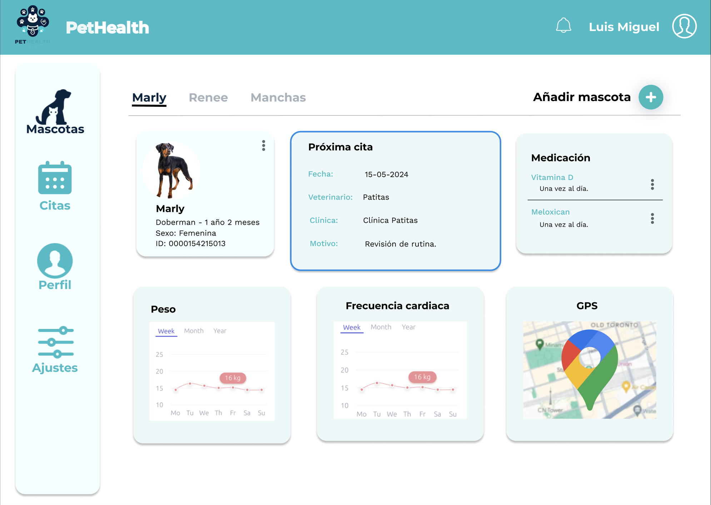
Vet View:
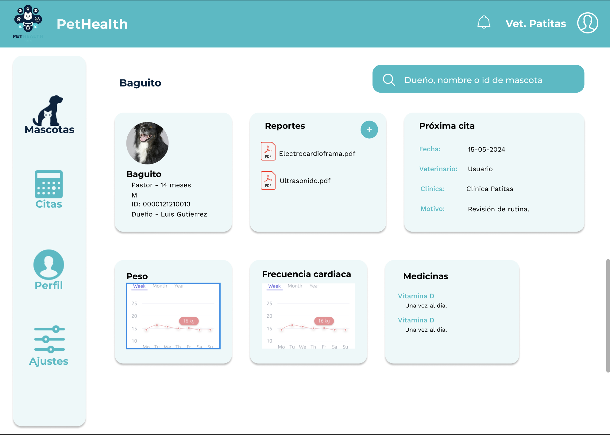
- Agregar mascotas:
User view:
En esta sección los usuarios PetOwner agregan una nueva mascota a su lista.
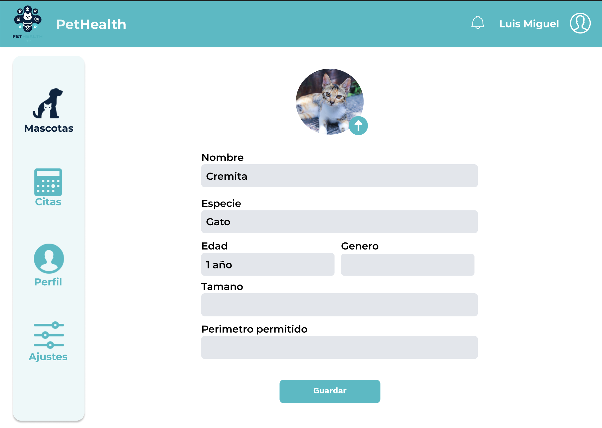
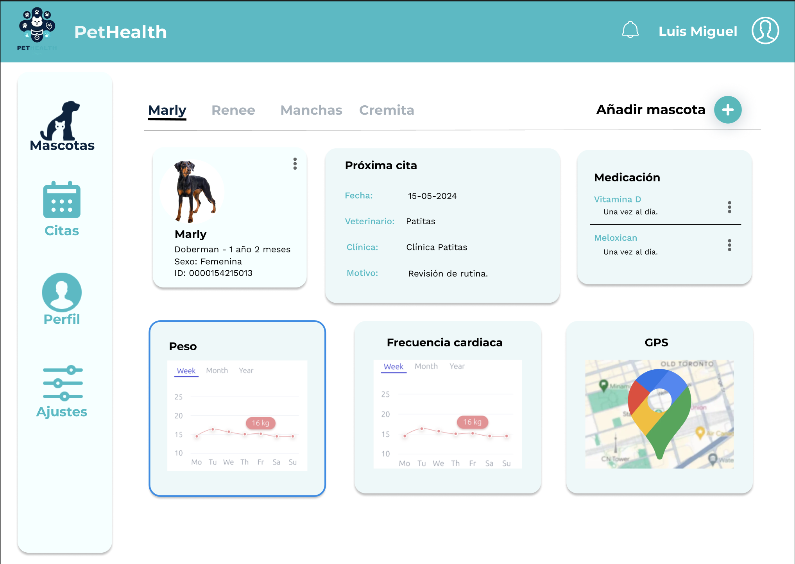
- Agendar citas:
En esta sección el usuario PetOwner puede ver y generar una nueva cita. Donde elige primero la clínica, luego el veterinario a cargo, y por último la fecha y hora de la cita.
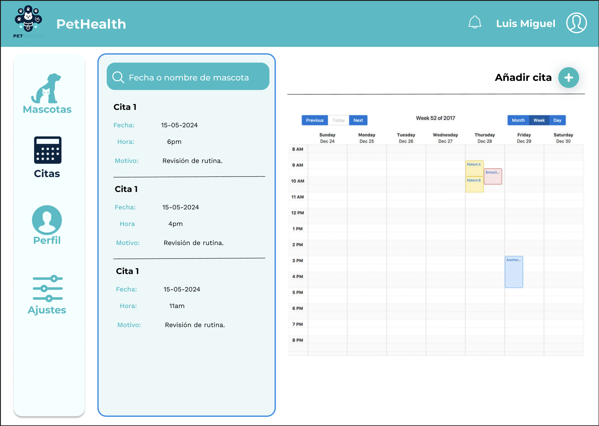
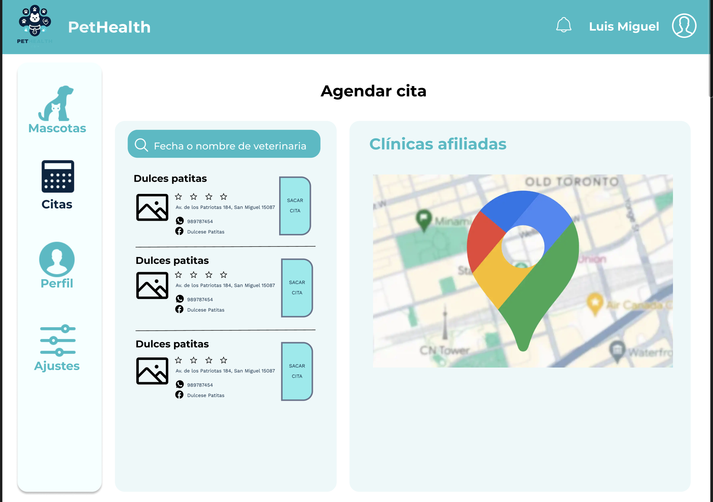
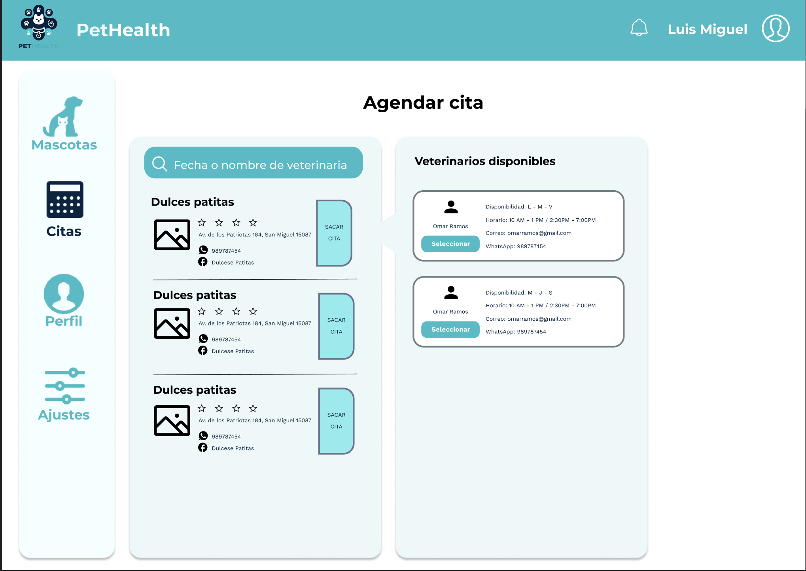
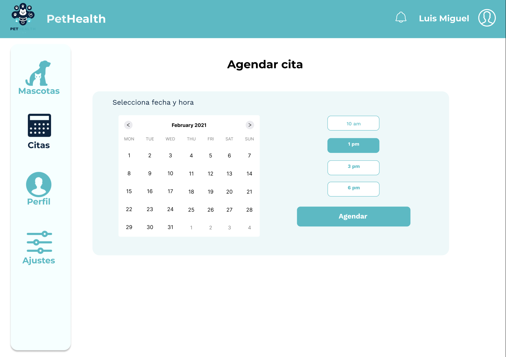
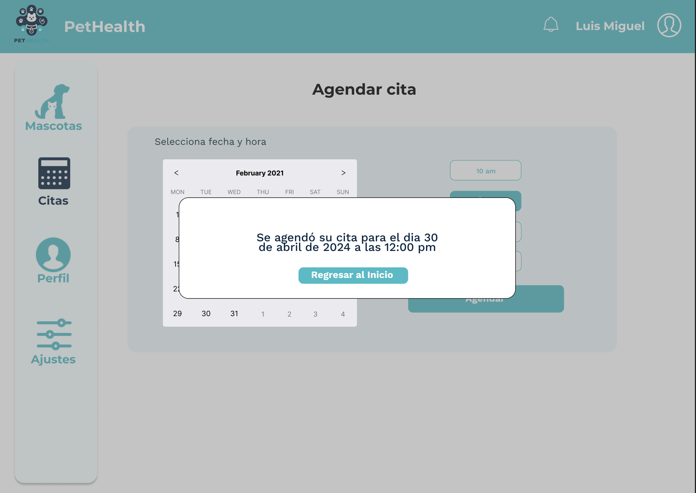
- Ver citas: 
En esta sección el usuario Vet puede ver las citas agendadas por sus clientes en la aplicación.
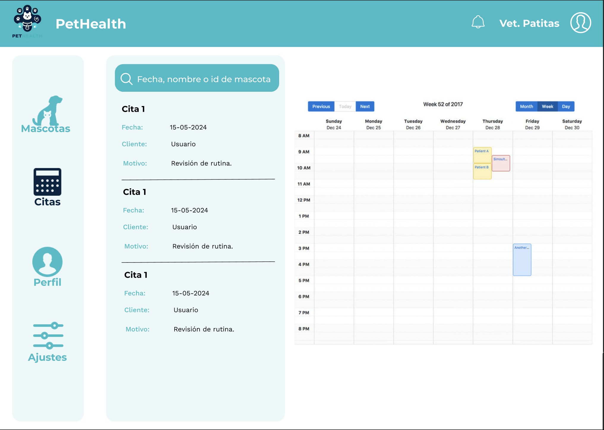
- Perfil:
En esta sección los usuarios pueden revisar y editar sus perfiles.
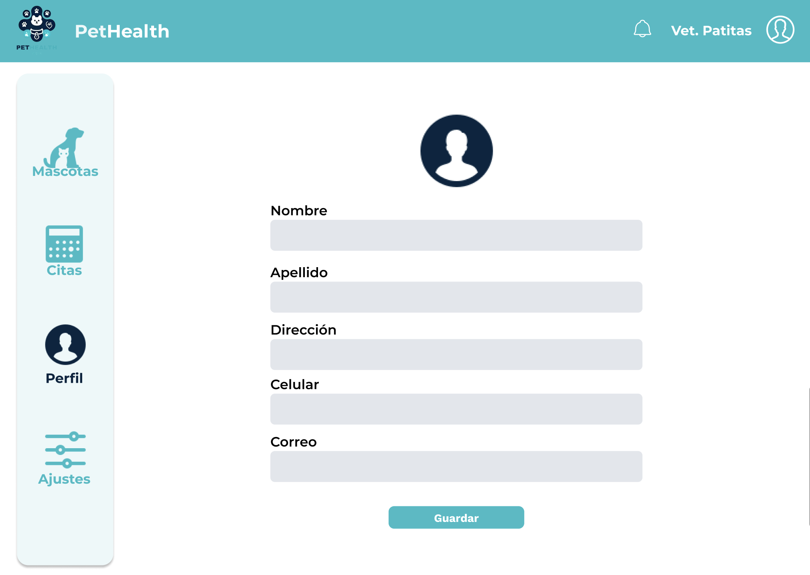
- Configuración de la cuenta:
En esta sección los usuarios pueden cambiar su contrasena, activar o desactivar notificaciones y cerrar sesión.
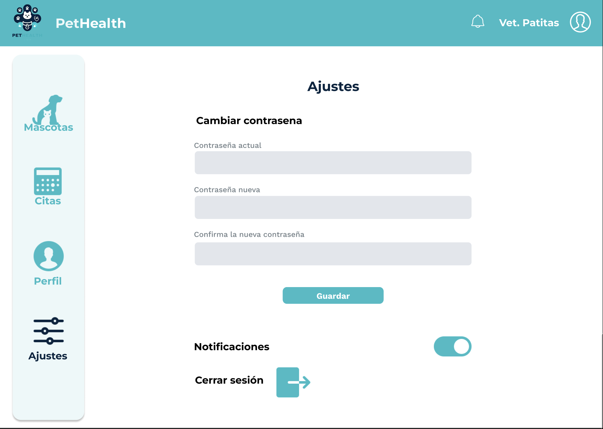
### 5.4.3. Applications User Flow Diagrams.
## 5.5. Applications Prototyping.